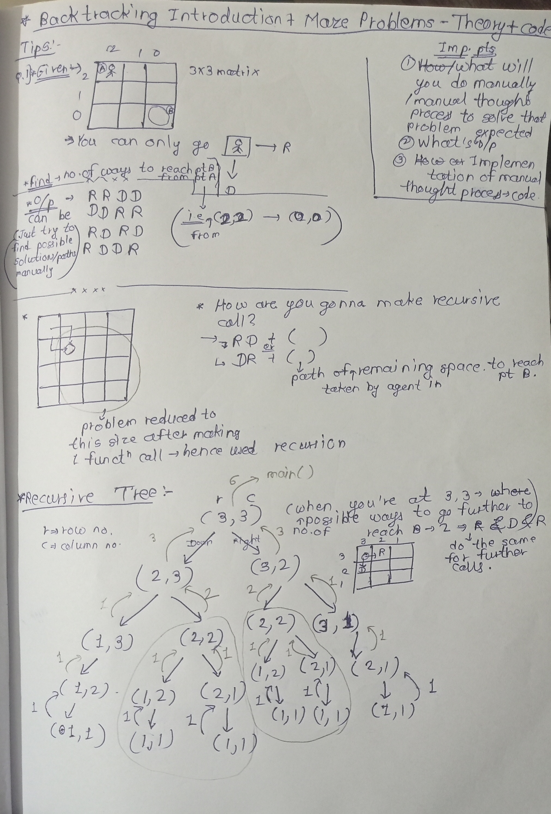
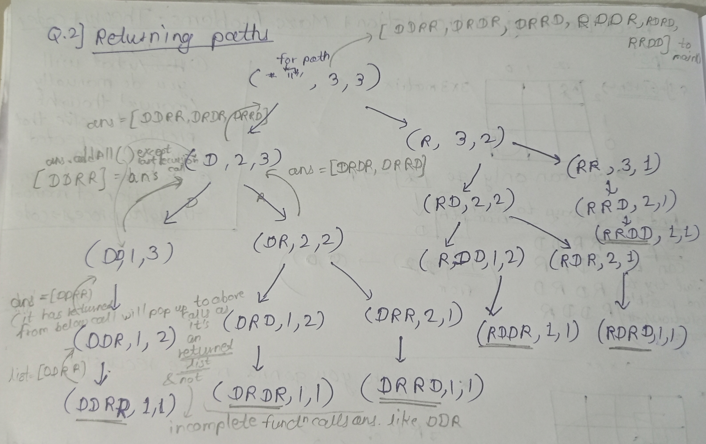
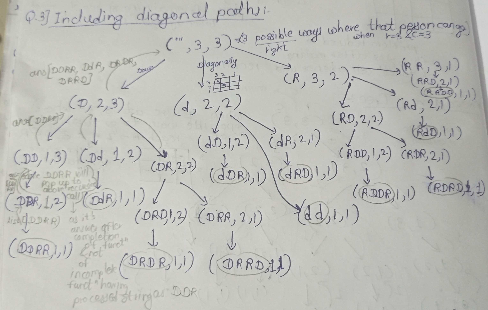
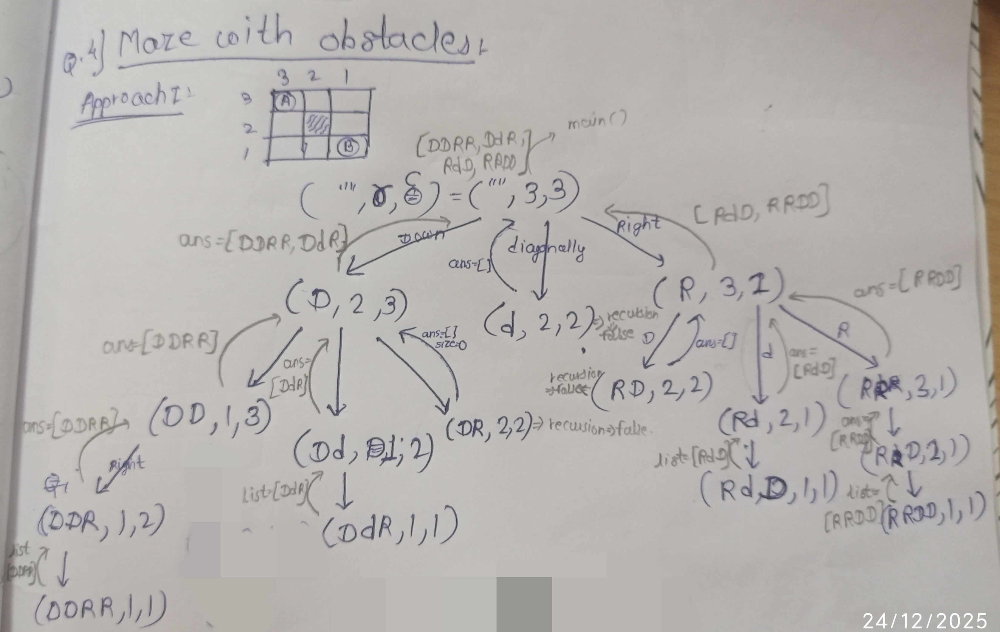
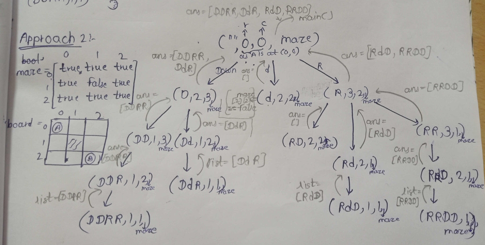
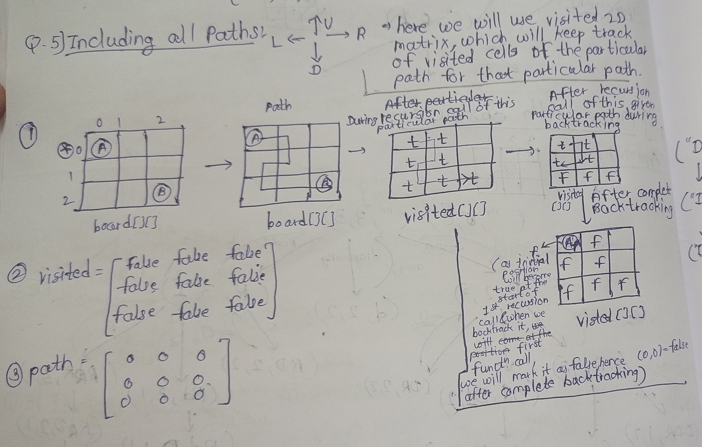

# Maze Problems:-
---
## 1)Find no. of possible ways to reach pt B:-Counting paths

```java
import java.util.ArrayList;
public class Main {
    public static void main(String[] args) {
        int r = 3;
        int c = 3;
        System.out.println(possibleWays(r,c));
    }
    public static int possibleWays(int r, int c){
        //when you have reached your destination i.e. at (1, 1)
        if(r == 1 && c == 1) return 1;

        int down = 0;
        int right = 0;
        if(r > 1){//you can go down only until r > 1
            down += possibleWays(r - 1, c);
        }
        if(c > 1){
            right += possibleWays(r, c - 1);
        }
        return down + right;
    }
}
o/p:-
6
```
---
## 2)Returning possible paths in an ArrayList :-

```java
import java.util.ArrayList;
public class Main {
    public static void main(String[] args) {
        int r = 3;
        int c = 3;
        System.out.println(possibleWays("", r, c));
    }
    public static ArrayList<String> possibleWays(String processed, int r, int c){
        //when you have reached your destination i.e. at (1, 1)
        if(r == 1 && c == 1) {
            ArrayList<String> list = new ArrayList<>();
            list.add(processed);
            return list;
        }
        ArrayList<String> ans = new ArrayList<>();
        if(r > 1){
            ans.addAll(possibleWays(processed + "D",r - 1, c));
        }
        if(c > 1){
            ans.addAll(possibleWays(processed + "R", r, c - 1));
        }
        return ans;
    }
}
o/p:-
[DDRR, DRDR, DRRD, RDDR, RDRD, RRDD]
```
---
## 3)Including Diagonal Paths:-

```java
import java.util.ArrayList;
public class Main {
    public static void main(String[] args) {
        int r = 3;
        int c = 3;
        System.out.println(possibleWays("", r, c));
    }
    public static ArrayList<String> possibleWays(String processed, int r, int c){
        //when you have reached your destination i.e. at (1, 1)
        if(r == 1 && c == 1) {
            ArrayList<String> list = new ArrayList<>();
            list.add(processed);
            return list;
        }
        ArrayList<String> ans = new ArrayList<>();
        if(r > 1){
            ans.addAll(possibleWays(processed + "D",r - 1, c));//move down if r > 1
        }
        if(r > 1 && c > 1){
            ans.addAll(possibleWays(processed + "d", r - 1, c - 1));//move diagonally
        }
        if(c > 1){
            ans.addAll(possibleWays(processed + "R", r, c - 1));//move right
        }
        return ans;
    }
}
o/p:-
[DDRR, DdR, DRDR, DRd, DRRD, dDR, dd, dRD, RDDR, RDd, RDRD, RdD, RRDD]
```
---
## 4)Maze with Obstacles:-but allow going diagonally from the sides of that path but if we move diagonally, our agent shouldn't land on obstacle
- here,change in recursive tree is only this -> when we come on the obstacle -> i.e. at (2, 2) = (r, c) => it will just return empty ans array at that point and stop the recursion call for that particular path(as it would be invalid path if we continue) and it will go back to the next line of the line from where it was called ,and will call the function written on that next line. 
## Approach 1:- hardcode obstacle position

```java
import java.util.ArrayList;
public class Main {
    public static void main(String[] args) {
        int r = 3;
        int c = 3;
        System.out.println(possibleWays("", r, c));
    }
    public static ArrayList<String> possibleWays(String processed, int r, int c){
        //when you are at obstacle i.e. at (2, 2) = river = obstacle -> skip the recursion call
        boolean recursion = true;
        if(r == 2 && c == 2){
            recursion = false;
        }
        //when you have reached your destination i.e. at (1, 1)
            if (r == 1 && c == 1) {
                ArrayList<String> list = new ArrayList<>();
                list.add(processed);
                return list;
            }
            ArrayList<String> ans = new ArrayList<>();
        if(recursion){
            if (r > 1) {
                ans.addAll(possibleWays(processed + "D", r - 1, c));//move down if r > 1
            }
            if (r > 1 && c > 1) {
                ans.addAll(possibleWays(processed + "d", r - 1, c - 1));//move diagonally
            }
            if (c > 1) {
                ans.addAll(possibleWays(processed + "R", r, c - 1));//move right
            }
        }
        return ans;
    }
}
o/p:-
[DDRR, DdR, RdD, RRDD]
```
## Approach 2:- Pass boolean maze[][] matrix as a parameter and whenever you encounter false just end recursion for that particular call just like we did in Approach1:- 

```java
import java.util.ArrayList;
public class Main {
    public static void main(String[] args) {
        int r = 3;
        int c = 3;
        boolean[][] maze = {
                {true, true, true},
                {true, false, true},
                {true, true, true}
        };
        System.out.println(possibleWays("", 0, 0, maze));
    }
    public static ArrayList<String> possibleWays(String processed, int r, int c, boolean[][] maze){
        //when you have reached your destination i.e. at (1, 1)
            if (r == maze.length - 1 && c == maze[0].length - 1) {
                ArrayList<String> list = new ArrayList<>();
                list.add(processed);
                return list;
            }
            ArrayList<String> ans = new ArrayList<>();
            if(maze[r][c]){
            if (r < maze.length - 1) {//when r == maze.length - 1,agent won't be able to go down anymore hence skip this part and go further
                ans.addAll(possibleWays(processed + "D", r + 1, c, maze));//move down if r > 1
            }
            if (r < maze.length - 1  && c < maze[0].length - 1) {
                ans.addAll(possibleWays(processed + "d", r + 1, c + 1, maze));//move diagonally
            }
            if (c < maze[0].length - 1) {
                ans.addAll(possibleWays(processed + "R", r, c + 1, maze));//move right
            }
        }
        return ans;
    }
}
```
---
##  5)Including All Paths:-Recursion + Backtracking:-
- This below image is reference for both Q.5 & Q.6

```java
 import java.util.ArrayList;
public class Main {
    public static void main(String[] args) {
        int r = 3;
        int c = 3;
        boolean[][] visited = new boolean[r][c];
        System.out.println(possibleWays("", 0, 0, r, c, visited));
    }
    //row is just to set boundary condition for Up path and col is just to set boundary condition for left path -> as we want same boundary conditions for every recursive call
    public static ArrayList<String> possibleWays(String processed, int r, int c, int row, int col, boolean[][] visited){
        //when you have reached your destination i.e. at (1, 1)
        if(r == visited.length - 1 && c == visited[0].length - 1) {
            ArrayList<String> list = new ArrayList<>();
            list.add(processed);
            return list;
        }
        if(visited[r][c]) return new ArrayList<>();//if we come at position which is already visited, stop the call by returning empty  ArrayList of size 0 => [] hence while adding in ans ArrayList, it(This recursion call) will add nothing...

        //mark visited,when you visit that position in a matrix
        visited[r][c] = true;

        ArrayList<String> ans = new ArrayList<>();

        if(r < visited.length - 1){
            ans.addAll(possibleWays(processed + "D",r + 1, c, row, col, visited));
        }
        if(c < visited[0].length - 1){
            ans.addAll(possibleWays(processed + "R", r, c + 1, row, col, visited));
        }

            if (c > 0) {
                ans.addAll(possibleWays(processed + "L", r, c - 1, row, col, visited));
            }
            if (r > 0) {
                ans.addAll(possibleWays(processed + "U", r - 1, c, row, col, visited));
            }

        visited[r][c] = false;//when the call is finished or when we complete recursion call for that particular path mark all visited cells as unvisited while backtracking/tracing previous function call/going up in recursive tree
        return ans;
    }
}
o/p:-
[DDRR, DDRURD, DDRUURDD, DRDR, DRRD, DRURDD, RDDR, RDRD, RDLDRR, RRDD, RRDLDR, RRDLLDRR]
```
## Q6 : Print Matrix(containing steps of path) and Paths(actual path-processed String)-including all paths:-
```java
import java.util.Arrays;
public class Main {
    public static void main(String[] args) {
        int r = 3;
        int c = 3;
        boolean[][] visited = new boolean[r][c];
        int[][] path = new int[r][c];
        printPath("", 0, 0, r, c, visited, path, 1);
    }
    //row is just to set boundary condition for Up path and col is just to set boundary condition for left path -> as we want same boundary conditions for every recursive call
    public static void printPath(String processed, int r, int c, int row, int col, boolean[][] visited, int[][] path, int step){
        //when you have reached your destination i.e. at (1, 1)
        if(r == visited.length - 1 && c == visited[0].length - 1) {
            path[r][c] = step;//to track last step as well
            for(int[] arr: path){
                    System.out.println(Arrays.toString(arr));
            }
            System.out.println(processed);
            System.out.println();
            return;
        }
        if(visited[r][c]) return;//if we come at position which is already visited, stop the call by returning empty  ArrayList of size 0

        //mark visited,when you visit that position in a matrix
        visited[r][c] = true;
        path[r][c] = step;

        if(r < visited.length - 1){
            printPath(processed + "D",r + 1, c, row, col, visited, path,step + 1);
        }
        if(c < visited[0].length - 1){
            printPath(processed + "R", r, c + 1, row, col, visited, path,step + 1);
        }

            if (c > 0) {
                printPath(processed + "L", r, c - 1, row, col, visited, path, step + 1);
            }
            if (r > 0) {
                printPath(processed + "U", r - 1, c, row, col, visited,path,step + 1);
            }

        visited[r][c] = false;//when the call is finished or when we complete recursion call for that particular path mark all visited cells as unvisited while backtracking/tracing previous function call/going up in recursive tree
        path[r][c] = 0;
    }
}
o/p:-
[1, 0, 0]
[2, 0, 0]
[3, 4, 5]
DDRR

[1, 0, 0]
[2, 5, 6]
[3, 4, 7]
DDRURD

[1, 6, 7]
[2, 5, 8]
[3, 4, 9]
DDRUURDD

[1, 0, 0]
[2, 3, 0]
[0, 4, 5]
DRDR

[1, 0, 0]
[2, 3, 4]
[0, 0, 5]
DRRD

[1, 4, 5]
[2, 3, 6]
[0, 0, 7]
DRURDD

[1, 2, 0]
[0, 3, 0]
[0, 4, 5]
RDDR

[1, 2, 0]
[0, 3, 4]
[0, 0, 5]
RDRD

[1, 2, 0]
[4, 3, 0]
[5, 6, 7]
RDLDRR

[1, 2, 3]
[0, 0, 4]
[0, 0, 5]
RRDD

[1, 2, 3]
[0, 5, 4]
[0, 6, 7]
RRDLDR

[1, 2, 3]
[6, 5, 4]
[7, 8, 9]
RRDLLDRR
```
