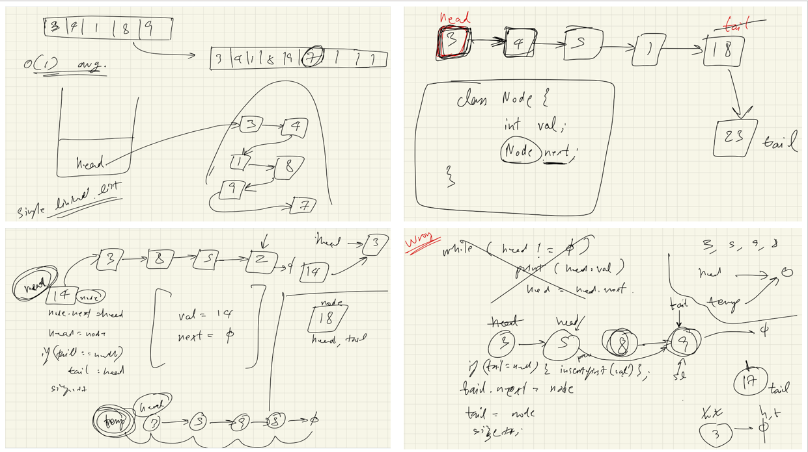
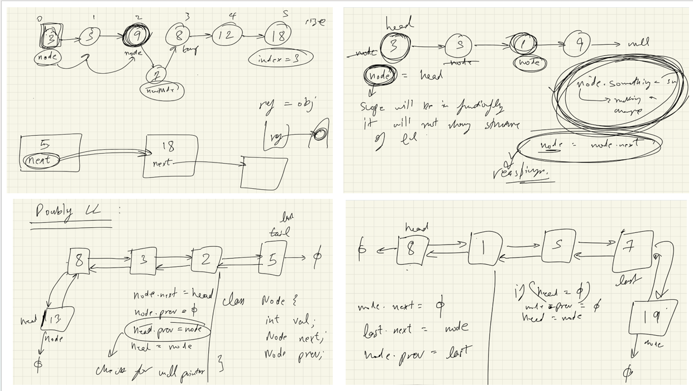
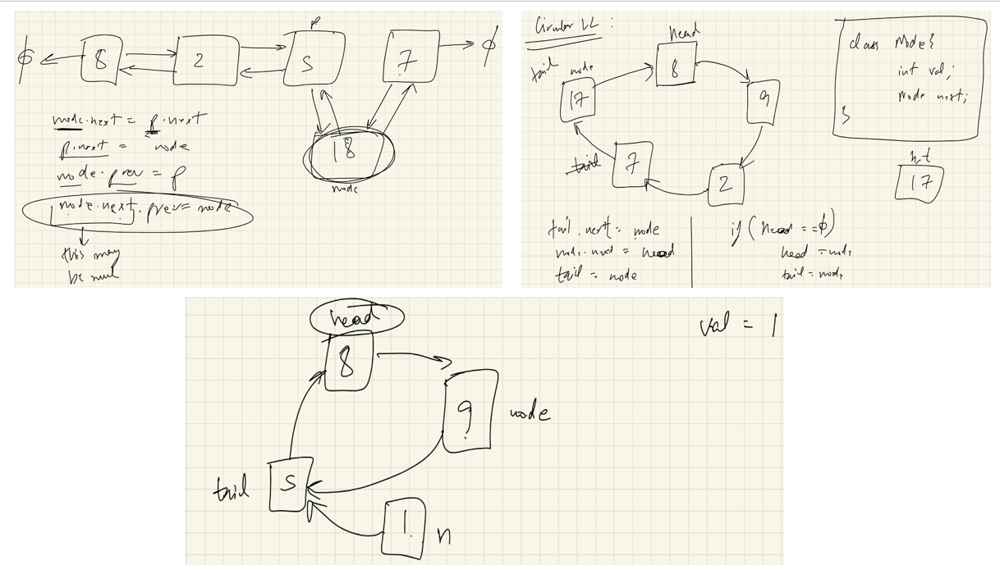

# 1. LinkedList Lecture 1:-all images



# Singly Linked List – 
2. Limitations of Array / ArrayList:-
- Arrays
- Fixed size
- Cannot insert beyond capacity
- Requires continuous memory
- ArrayList
- When full, creates a new bigger array
- Copies all elements → costly

3. What is a Linked List?
- Non-contiguous memory allocation
- Nodes stored at random memory locations
- Connected using references
- Logical view:
- 3 → 4 → 1 → 8 → 9 → null
- 4. Node Structure
- Each node contains:
- Value
- Next reference
```java
private class Node {
    int value;      // data stored in node
    Node next;      // reference to next node

    Node(int value) {
        this.value = value;
        this.next = null; // default
    }

    Node(int value, Node next) {
        this.value = value;
        this.next = next; // tells which node comes next
    }
}
```
5. Singly Linked List
- Each node knows only the next node
- One-directional traversal

6. Head & Tail
- Head → first node
- Tail → last node
```java
private Node head;
private Node tail;
private int size;
```
7. Insert at First (O(1))
```java
public void insertFirst(int value) {
    Node node = new Node(value);
    node.next = head;
    head = node;

    if (tail == null) {
        tail = head;
    }
    size++;
}
```
8. Insert at Last (O(1) using tail)
```java
public void insertLast(int value) {
    if (tail == null) {
        insertFirst(value);
        return;
    }
    Node node = new Node(value);
    tail.next = node;
    tail = node;
    size++;
}
```
9. Insert at Index (O(n))
```java
public void insert(int value, int index) {
    if (index == 0) {
        insertFirst(value);
        return;
    }
    if (index == size) {
        insertLast(value);
        return;
    }

    Node temp = head;
    for (int i = 1; i < index; i++) {
        temp = temp.next;
    }

    Node node = new Node(value, temp.next);
    temp.next = node;
    size++;
}
```
10. Display Linked List:-

⚠️ Never move head
```java
public void display() {
    Node temp = head;
    while (temp != null) {
        System.out.print(temp.value + " -> ");
        temp = temp.next;
    }
    System.out.println("END");
}
```
11. Delete First (O(1))
```java
public int deleteFirst() {
    int value = head.value;
    head = head.next;

    if (head == null) {
        tail = null;
    }
    size--;
    return value;
}
```
12. Delete Last (O(n))
```java
public int deleteLast() {
    if (size <= 1) {
        return deleteFirst();
    }

    Node secondLast = head;
    while (secondLast.next != tail) {
        secondLast = secondLast.next;
    }

    int value = tail.value;
    tail = secondLast;
    tail.next = null;
    size--;
    return value;
}
```
13. Delete at Index (O(n))
```java
public int delete(int index) {
    if (index == 0) {
        return deleteFirst();
    }
    if (index == size - 1) {
        return deleteLast();
    }

    Node prev = head;
    for (int i = 1; i < index; i++) {
        prev = prev.next;
    }

    int value = prev.next.value;
    prev.next = prev.next.next;
    size--;
    return value;
}
```
14. Get Node at Index
```java
public Node get(int index) {
    Node temp = head;
    for (int i = 0; i < index; i++) {
        temp = temp.next;
    }
    return temp;
}
```
15. Find a Value
```java
public Node find(int value) {
    Node node = head;
    while (node != null) {
        if (node.value == value) {
            return node;
        }
        node = node.next;
    }
    return null;
}
```
16. Time Complexity Summary
- Operation Time:-
- Insert First
O(1)
- Insert Last
O(1)
- Insert at Index
O(n)
- Delete First
O(1)
- Delete Last
O(n)
- Search
O(n)
- Display
O(n)

## Key Concept: Traversal vs Modification
- During traversal, the original linked list is NOT changed
- We only reassign a temporary reference variable
- Example:
node = node.next → moves the reference
- Does NOT modify the actual list
- Actual modification happens only with:
- node.next = something

👉 Traversal = reassignment, not modification

## Singly vs Doubly Linked List (Intuition)
- Singly Linked List = one‑sided love 😄
- Node knows next
- Cannot go backward

## Doubly Linked List = two‑way connection
- Node knows next AND previous
- DOUBLY LINKED LIST
- Why Doubly Linked List?
- In singly LL, no direct way to move backward
- Doubly LL adds one extra reference → previous
- Internal Structure of Doubly Linked List
- Every node contains:

value,

next,

previous

- Rules:
head.previous = null &

tail.next = null

### Node Structure (Doubly Linked List)
```java
private class Node {
    int value;
    Node next;
    Node previous;


    Node(int value) {
        this.value = value;
    }


    Node(int value, Node next, Node previous) {
        this.value = value;
        this.next = next;
        this.previous = previous;
    }
}
```
##### Insert First in Doubly Linked List Logic :
- Create new node
- node.next = head
- node.previous = null
- If head != null → head.previous = node
- head = node

⚠️ Null check is mandatory to avoid NullPointerException
```java
public void insertFirst(int value) {
    Node node = new Node(value);
    node.next = head;
    node.previous = null;


    if (head != null) {
        head.previous = node;
    }
    head = node;
}
```
⏱ Time Complexity: O(1)

##### Display Doubly Linked List (Forward)
Important Rule:
- Use temporary variable, never move head
```java
public void display() {
    Node node = head;
    while (node != null) {
        System.out.print(node.value + " -> ");
        node = node.next;
    }
    System.out.println();
}
```
##### Display Doubly Linked List (Reverse) Logic:
- First traverse forward to reach last node
- Then move backward using previous
```java
public void displayReverse() {
    Node node = head;
    Node last = null;


    while (node != null) {
        last = node;
        node = node.next;
    }


    while (last != null) {
        System.out.print(last.value + " -> ");
        last = last.previous;
    }
    System.out.println();
}
```
##### Insert Last in Doubly Linked List (No Tail) Logic:
- Create new node
- If head == null:
- head = node
- node.previous = null
- return
- Traverse till last (last.next == null)
- last.next = node
- node.previous = last
- node.next = null
```java
public void insertLast(int value) {
    Node node = new Node(value);
    node.next = null;


    if (head == null) {
        node.previous = null;
        head = node;
        return;
    }


    Node last = head;
    while (last.next != null) {
        last = last.next;
    }


    last.next = node;
    node.previous = last;
}
```
⏱ Time Complexity: O(n)

##### Insert After a Given Value (Doubly Linked List)
Problem:
- Insert newValue after a node containing value:-
- Find node p
- Create new node
- node.next = p.next
- p.next = node
- node.previous = p
- If node.next != null → node.next.previous = node
⚠️ Null check required when inserting after last node
```java
public void insertAfter(int value, int newValue) {
    Node p = find(value);
    if (p == null) return;


    Node node = new Node(newValue);
    node.next = p.next;
    p.next = node;
    node.previous = p;


    if (node.next != null) {
        node.next.previous = node;
    }
}
```
⏱ Time Complexity: O(n)

# CIRCULAR LINKED LIST
Key Property
- No node points to null
- Last node points back to head
```java
Node Structure (Circular LL)
private class Node {
    int value;
    Node next;


    Node(int value) {
        this.value = value;
    }
}
```
Circular Linked List Fields
```java
private Node head;
private Node tail;
```
##### Insert in Circular Linked List Logic:
- Create new node
- If list is empty:
- head = node
- tail = node
- node.next = head
- Else:
- tail.next = node
- node.next = head
- tail = node
```java
public void insert(int value) {
    Node node = new Node(value);


    if (head == null) {
        head = node;
        tail = node;
        node.next = head;
        return;
    }


    tail.next = node;
    node.next = head;
    tail = node;
}
```
##### Display Circular Linked List Rule:
- Must print at least once → use do‑while
```java
public void display() {
    if (head == null) return;


    Node node = head;
    do {
        System.out.print(node.value + " -> ");
        node = node.next;
    } while (node != head);
    System.out.println();
}
```
⏱ Time Complexity: O(n)

##### Delete Value in Circular Linked List
- Case 1: Empty List
- Return

- Case 2: Delete Head
- head = head.next
- tail.next = head

- Case 3: Delete Other Node
- Traverse
- Check node.next.value
- Skip node
```java
public void delete(int value) {
    if (head == null) return;


    Node node = head;


    if (node.value == value) {
        head = head.next;
        tail.next = head;
        return;
    }


    do {
        Node n = node.next;
        if (n.value == value) {
            node.next = n.next;
            break;
        }
        node = node.next;
    } while (node != head);
}
```
⏱ Time Complexity: O(n)

---
