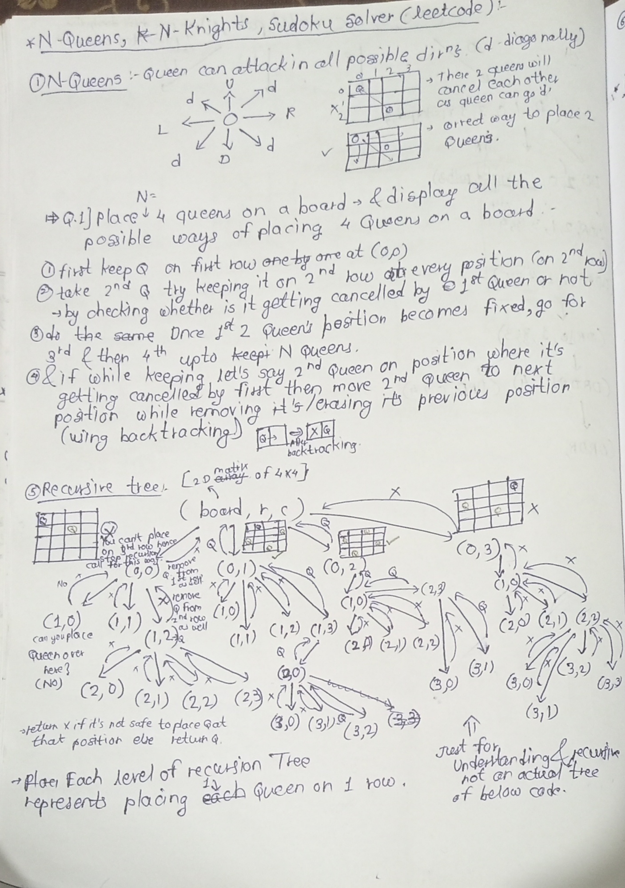
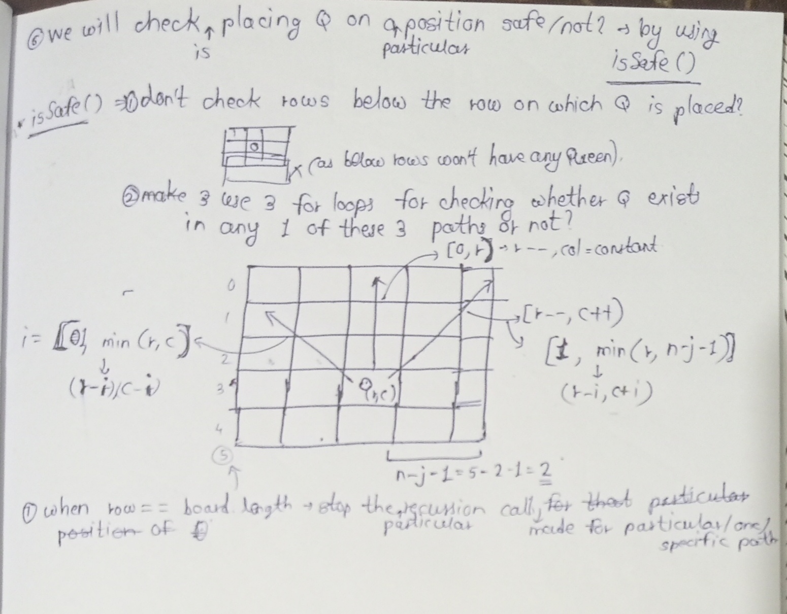
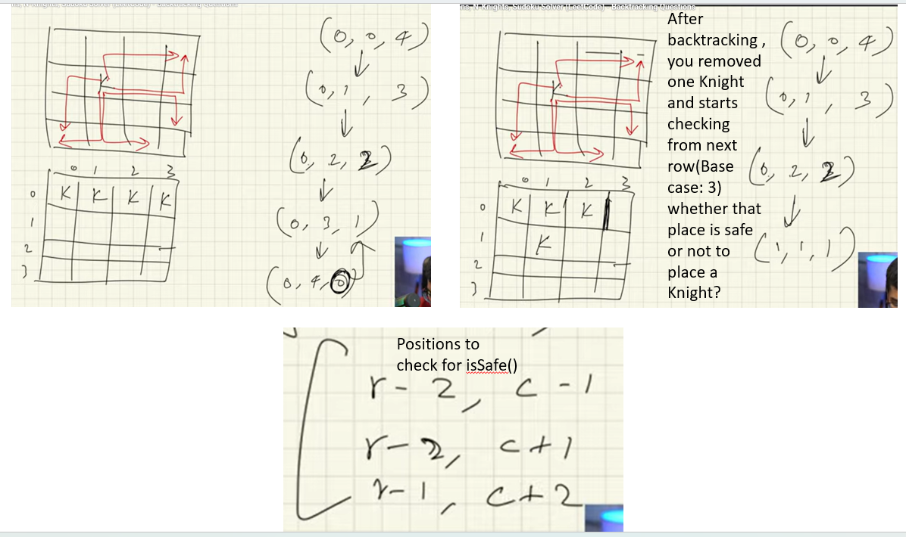
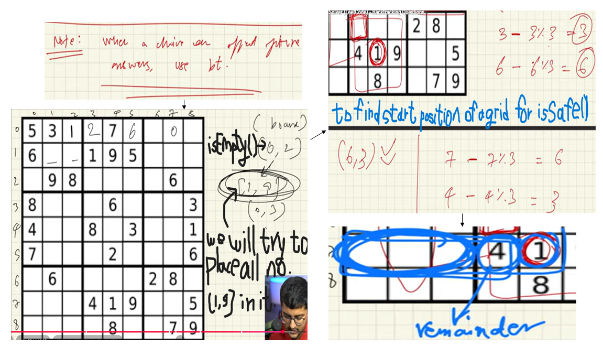

# 1)Q1 : N-Queens Problem


```java
import java.util.Arrays;
public class Main {
    public static void main(String[] args) {
        boolean[][] board = new boolean[4][4];
        System.out.println(queens(board, 0));
    }

    public static int queens(boolean[][] board, int row){
        if(row == board.length){
            display(board);
            System.out.println();
            return 1;//to count number of possible ways to place N queens
            }
        int count = 0;
        //Placing queen and checking for every row and column
        for(int col = 0; col < board[0].length; col++){
            //place queen if it is safe
            if(isSafe(board, row, col)){
                board[row][col] = true;
                count += queens(board, row + 1);
                board[row][col] = false;//backtrack
            }
        }
        return count;
        }
        public static boolean isSafe(boolean[][] board, int row, int col){
        //check vertical col
            for(int i = 0; i < row; i++){
                if(board[i][col]){
                    return false;
                }
            }
        //check diagonal left
        for(int i = 1; i <= Math.min(row, col); i++){
            if(board[row - i][col - i]){
                return false;
            }
        }
        //check diagonal right
        for(int i = 0; i <= Math.min(row, board.length - col - 1); i++){
            if(board[row - i][col + i]){
                return false;
            }
        }
        return true;
        }
        public static void display(boolean[][] board){
        for(boolean[] arr: board){
            for(boolean element: arr){
                if(element){
                    System.out.print("Q ");
                }
                else{
                    System.out.print("X ");
                }
            }
            System.out.println();
        }
    }
}
o/p:-
X Q X X 
X X X Q 
Q X X X 
X X Q X 

X X Q X 
Q X X X 
X X X Q 
X Q X X 

2
```
---
# Time and Space complexity
# ⬛ N-Queens Problem — Time & Space Complexity Analysis

This document analyzes the **time and space complexity** of a **backtracking-based N-Queens solution in Java**.

---

## 🔁 Recurrence Relation

Let **N** be the number of queens (size of the board).

$$
T(N) = N \cdot T(N-1) + O(N^2)
$$

---

## 📌 Meaning of Each Term

### **T(N)**
Time required to place queens in **N remaining rows**.

---

### **N · T(N−1)**

- At a given row, the algorithm tries **all N columns**
- For each safe placement, it recursively solves the remaining **N−1 rows**
- Hence, in the worst case, **N recursive calls** are made

---

### **O(N²)** — Non-Recursive Work

### **O(N)** — Safety Check Cost

For each queen placement, `isSafe()` performs:

| Check | Time |
|----|----|
| Vertical column | O(N) |
| Left diagonal | O(N) |
| Right diagonal | O(N) |

Total safety check per placement:

\[
O(N)
\]

- i.e each queen requires N checks for isSafe(),(total queens to be placed) N * Total checks N reuired for each queen placement(as given above - total checks per placement)
  
Total work per level:

$$
O(N \times N) = O(N^2)
$$

---

## 🔄 Manual Unrolling (Step-by-Step)

Starting recurrence:

$$
T(N) = N \cdot T(N-1) + O(N^2)
$$

---

### 🔹 Step 1: Expand `T(N−1)`

At row **N−1**, the algorithm tries **(N−1) columns**:

$$
T(N-1) = (N-1) \cdot T(N-2) + O(N^2)
$$

---

### 🔹 Step 2: Substitute into `T(N)`

$$
T(N) = N \cdot (N-1) \cdot T(N-2) + O(N^3)
$$

---

### 🔹 Step 3: Expand Further

$$
T(N-2) = (N-2) \cdot T(N-3) + O(N^2)
$$

$$
T(N) = N \cdot (N-1) \cdot (N-2) \cdot T(N-3) + O(N^4)
$$

---

### 🔹 Step 4: Continue Until Base Case

$$
T(N) = N \cdot (N-1) \cdot (N-2) \cdots 1 \cdot T(0)
$$

$$
T(N) = N!
$$

Polynomial terms are dominated by factorial growth.

---

## 📐 Akra–Bazzi Interpretation

Although the recurrence is **not divide-and-conquer**, it exhibits:

- Linearly increasing branching factor
- Recursion depth of **N**
- Multiplicative expansion across recursion levels

This results in **factorial time complexity**:

$$
T(N) = O(N!)
$$

---

## ⏱ Time Complexity

| Case | Complexity |
|------|-----------|
| Worst Case | O(N!) |
| Average Case | O(N!) |
| Best Case | O(N!) |

(Backtracking explores permutations of queen placements)

---

## 🧠 Space Complexity

### 1️⃣ Board Storage

```java
boolean[][] board = new boolean[N][N];
```
- you can eleminate for loops by increasing number of parameters in function call.
---
# 2)N-Knights problem:-In image it's started instead of starts
​
```java
import java.util.Arrays;
public class Main {
    public static void main(String[] args) {
        boolean[][] board = new boolean[4][4];
        int knights = 4;
        Knights(board, 0, 0, knights);
    }

    public static void Knights(boolean[][] board, int row, int col, int knights){
        //Base case 1: All Knights placed
        if(knights == 0){
            display(board);
            System.out.println();
            return;
            }
        // BASE CASE 2: Out of rows (Board finished)
        if (row == board.length) {
            return;
        }
        //Base case: 3
        //if you are at last column after backtracking and in the same row if there are 3 knights you can just go to the next line to check ,can you place night over there or not?
        if(col == board[0].length){
            Knights(board, row + 1, 0, knights);
            return;
        }
        //Placing queen and checking for every row and column
            if(isSafe(board, row, col)){
                board[row][col] = true;
                Knights(board, row, col + 1, knights - 1);
                board[row][col] = false;//backtrack
            }
            //if current row and col are not safe to place a Knight just move ahead
            Knights(board, row, col + 1, knights);
        }
        //to check whether a position which we are using to check whether Knight exist there or not is valid / not?otherwise if we are trying to access element which is out of bounds it will give IOBE hence use isValid() to avoid IOBE...
       public static boolean isValid(boolean[][] board, int row, int col){
         return row >= 0 && row < board.length && col >= 0 && col < board[0].length;
       }
       //if any Knight exists in L shape return false,3 moves are must.
       public static boolean isSafe(boolean[][] board, int row, int col){
        if(isValid(board, row - 2, col - 1)){
            if(board[row - 2][col - 1]){
                return false;
            }
        }
           if(isValid(board, row - 2, col + 1)) {
               if (board[row - 2][col + 1]) {
                   return false;
               }
           }
           if(isValid(board, row - 1, col - 2)){
               if(board[row - 1][col - 2]){
                   return false;
               }
           }
           if(isValid(board, row - 1, col + 2)){
               if(board[row - 1][col + 2]){
                   return false;
               }
           }
        return true;
        }
        public static void display(boolean[][] board){
        for(boolean[] arr: board){
            for(boolean element: arr){
                if(element){
                    System.out.print("K ");
                }
                else{
                    System.out.print("X ");
                }
            }
            System.out.println();
        }
    }
}
o/p:-
K K K 
X K X 
X X X 

K K X 
K K X 
X X X 

K X K 
X K X 
K X X 

K X K 
X K X 
X X K 

K X K 
X X X 
K X K 

K X X 
K K X 
K X X 

K X X 
X K X 
K X K 

X K K 
X K K 
X X X 

X K X 
K K K 
X X X 

X K X 
K K X 
X K X 

X K X 
K X K 
X K X 

X K X 
X K K 
X K X 

X X K 
X K K 
X X K 

X X K 
X K X 
K X K 

X X X 
K K K 
X K X 

X X X 
K K X 
K K X 

X X X 
X K K 
X K K 

X X X 
X K X 
K K K 
```
# Knights Placement Complexity Analysis

* **Time Complexity:** $O(2^{n^2})$
    * For every cell on the $n \times n$ board, the algorithm makes two recursive choices: either place a knight or don't place a knight, leading to an exponential number of branches.


* **Space Complexity:** $O(n^2)$
    * The algorithm uses a 2D boolean array of size $n \times n$ and the recursion stack depth can reach $n^2$ as it visits every cell on the board.


---

#### Understanding the $2^{n^2}$ Logic
- In your code, the total number of squares is $n \times n = n^2$ (for a 4x4 board, this is 16). At each square, the code explores two possibilities (the `if(isSafe)` branch and the "move ahead" branch). This results in a worst-case theoretical complexity of $2^{16}$ operations. While the `isSafe` check prevents many invalid placements, the mathematical upper bound is determined by these two choices per cell.
---
# 3)Sudoku Solver:-

```java
import java.util.Arrays;
public class Main {
    public static void main(String[] args) {
        int[][] board = {
                {5, 3, 0, 0, 7, 0, 0, 0, 0},
                {6, 0, 0, 1, 9, 5, 0, 0, 0},
                {0, 9, 8, 0, 0, 0, 0, 6, 0},
                {8, 0, 0, 0, 6, 0, 0, 0, 3},
                {4, 0, 0, 8, 0, 3, 0, 0, 1},
                {7, 0, 0, 0, 2, 0, 0, 0, 6},
                {0, 6, 0, 0, 0, 0, 2, 8, 0},
                {0, 0, 0, 4, 1, 9, 0, 0, 5},
                {0, 0, 0, 0, 8, 0, 0, 7, 9}
        };
        if(solve(board)){
            display(board);
        }
        else{
            System.out.println("Cannot solve");
        }
    }

    //Main recursive function
    public static boolean solve(int[][] board) {
        int n = board.length;
        int row = -1;
        int col = -1;
        boolean emptyLeft = true;
        //this nested loop is just to find which places are empty and if they are empty then save the row and col to check which number is safe to put that number over there.
        //this is how we are placing r,c in an arguments by finding place which is empty i.e.(0, 2) in a recursive tree given in above image.
        for (int i = 0; i < n; i++) {
            for (int j = 0; j < n; j++) {
                //can add no. only from 1-9
                if (board[i][j] == 0) {
                    row = i;
                    col = j;
                    emptyLeft = false;//i.e.mark it as filled as we are going to fill it using function call which we did in next nested for loop
                    break;
                }
                //if you find an empty element in row,then break to call a function which will find number to place in it
                if (emptyLeft == false) {
                    break;
                }
            }
        }
        //if you don't find any empty element in a sudoku using above nested for loop that means sudoku is solved!!
        if (emptyLeft == true) {
            return true;
        }
        //backtrack, try to put all numbers from 1-9 in that empty cell
        for (int i = 1; i <= 9; i++) {
            if (isSafe(board, row, col, i)) {
                board[row][col] = i;
                if (solve(board)) {
                    //i.e.if no empty element left after placing this number then return true
                    //found the answer
                    return true;
                } else {
                    //backtrack,i.e.whatever changes you made just remove those changes
                    board[row][col] = 0;
                }
            }
        }
        return false;//even after checking all numbers from 1-9 for every cell,if still some cells remain empty as if you didn't able t put any number over there then you can't solve that sudoku, hence return false

    }

    public static boolean isSafe(int[][] board, int row, int col, int num) {
        //check the row
        for (int i = 0; i < board.length; i++) {
            //check if the number is in the row
            if (board[row][i] == num) {
                return false;
            }
        }
        //check for col
        for (int i = 0; i < board[0].length; i++) {
            if (board[i][col] == num) {
                return false;
            }
        }
        //check for grid
        int sqrt = (int) (Math.sqrt(board.length));//to find out row length of each grid to check in a grid
        int rowStart = row - (row % sqrt);//here,remainder will give us extra items which will come after a particular grid which will help us to eliminate those positions as given in figure above...
        int colStart = col - (col % sqrt);
        //0-based indexing is used.
        for (int i = rowStart; i < rowStart + sqrt; i++) {
            for (int j = colStart; j < colStart + sqrt; j++) {
                if (board[i][j] == num) {
                    return false;
                }
            }
        }
        return true;
    }

    public static void display(int[][] board) {
        for (int[] arr : board) {
            for (int number : arr) {
                System.out.print(number + " ");
            }
            System.out.println();
        }
    }
}
o/p:-
5 3 2 2 7 3 1 2 3 
6 4 7 1 9 5 4 5 7 
1 9 8 4 6 8 8 6 9 
8 1 2 1 6 4 2 4 3 
4 3 5 8 5 3 5 7 1 
7 6 9 7 2 9 8 9 6 
3 6 4 2 3 5 2 8 1 
2 5 7 4 1 9 3 4 5 
1 8 9 6 8 7 6 7 9
```
# Time & Space complexity of above Sudoku solver code:-
# Sudoku Solver Complexity Analysis

* **Time Complexity:** $O(n^{n^2})$,here T.C.:-O(9^(n^2))
    * The algorithm tries up to $n$ possibilities for each of the $n^2$ cells, leading to an exponential number of recursive branches.


* **Space Complexity:** $O(n^2)$
    * The memory is used by the 2D board and the recursion stack, which can go as deep as the total number of cells ($n \times n$).


---

### Understanding the $n^2$ in the exponent
In a $9 \times 9$ board, $n = 9$. The total number of squares is $n^2 = 81$. Since each square can technically hold any of the $n$ digits, the worst-case number of combinations the code might check is $9^{81}$. In practice, the `isSafe` check prunes most of these branches, but the theoretical limit remains exponential.
