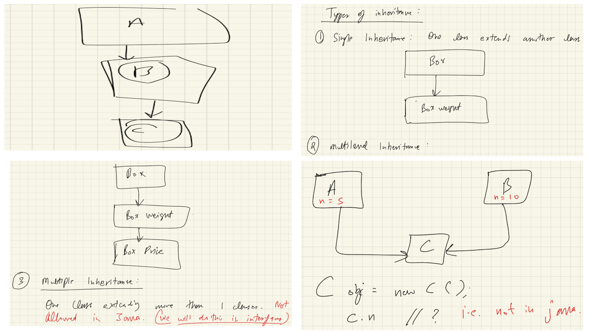
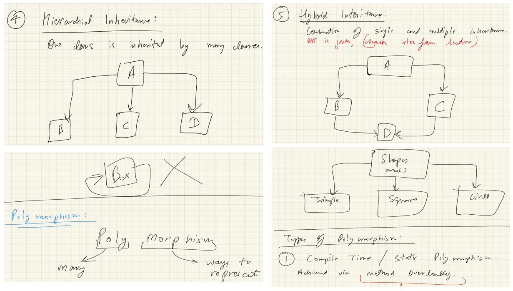
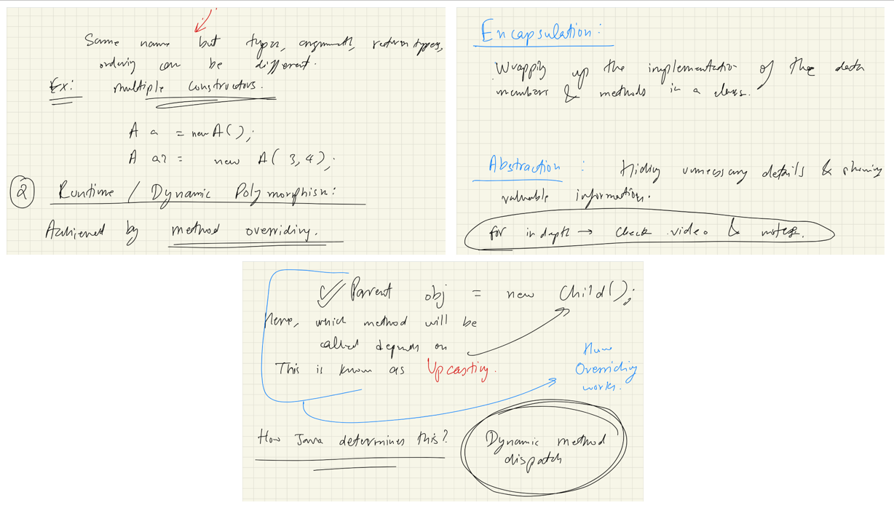

# OOP 3:-




# OOP :-
1. Introduction to OOP = Object Oriented Programming
Programming is divided into classes and objects

- Focus is on real-life modeling
Improves:
Code security
Code reuse
Maintainability

2. Principles of OOP (Mentioned in Video)
Encapsulation
Inheritance
Polymorphism
Abstraction

# Inheritance :-
3. What is Inheritance?
- Inheritance means child class acquires properties of parent class
- Parent class = Base class / Super class
- Child class = Derived class / Sub class

Real-life Example :-
- Parents pass:
Money,
Values,
Habits,
Properties.
- Similarly, a class passes variables and methods to another class

4. Basic Definition (Programming)
One class is created
Another class extends it

Child class can use:
Variables,
Methods,
Functions of parent class

5. Syntax of Inheritance (Java)
class Parent {
    int x;
}

class Child extends Parent {
    int y;
}

extends keyword is used.
Child class gets access to parent members

6. Parent & Child Class Relationship
- Parent class:
Contains common properties
- Child class:
Contains parent properties,
Plus its own additional properties

Example :-
- Base class: Box

- parent properties:-length, width, height

- Child class:
Inherits dimensions
& Adds extra features

7. Constructors in Inheritance
- Constructors are not inherited
- When child object is created:
Parent constructor executes first, 
Then child constructor executes
- Important Rule
Parent constructor must be called,
If not written explicitly, Java calls it automatically

8. super Keyword
- Used to:
Call parent constructor
- Access parent variables
- Access parent methods
- Example Meaning:-
super.variable → parent variable
- super() → parent constructor

9. Access Modifiers & Inheritance
- private Keyword
- private members:
❌ NOT accessible in child class
- Even though child inherits the class, private data is hidden

Important Statement :-
“Private members belong only to that class, not even child class can access them directly.”

10. Reference Variable Concept (Important)
- Access depends on reference type, not object type
- Example meaning from video:
- Parent obj = new Child();

- Accessible:
Parent class members
- Not accessible:
Child-specific members

11. Types of Inheritance (Video Mentions)
*Single Inheritance
- One parent → one child
- Most commonly used
- Fully supported in Java
- class A { }
- class B extends A { }

# Key Points Repeated in Video
- Inheritance promotes code reuse
- Child class automatically gets parent features
- Constructors are special, not inherited
- super connects child to parent
- private restricts access
- Java follows class hierarchy
- Inheritance uses extends
- Parent constructor executes first
- Private members are not inherited
- Access is decided by reference type
- Java supports single inheritance using classes

Multiple Inheritance (Java)
*Multiple Inheritance means:
One child class inherits from more than one parent class
*Example idea:
Class C extends A, B   ❌ (Not allowed in Java)

Why Multiple Inheritance is NOT Supported in Java (Classes):-
- Causes ambiguity problem
- If both parent classes have:
Same signature(if they share the same method name and the exact same parameter list (same number, type, and order of parameters). The return type and access modifiers are not considered part of the method signature for this purpose.),same return type.
→ Java cannot decide which method to call
- This is called:
Diamond Problem, Leads to conflicts
- Java’s Decision
❌ Multiple inheritance using classes is not allowed
✅ Achieved using interfaces

How Java Supports Multiple Inheritance:-
- Using Interfaces
- Interfaces contain:
Method declarations (no implementation)
Hence, no ambiguity

Hierarchical Inheritance
Meaning
One parent class
Multiple child classes

-Structure
Parent class can have 3 inherited child classes.

Key Points
- All child classes inherit:
- Same properties of parent
- Very simple
- Fully supported in Java

Hybrid Inheritance
Combination of:
Single inheritance
Multiple inheritance

Important Point
Hybrid inheritance involves multiple inheritance
Therefore:
❌ Not allowed using classes
✅ Achieved using interfaces

---
# KK notes:-
## Inheritance-
To inherit a class, you simply incorporate the definition of one class into another by using the extends keyword.

class subclass-name extends superclass-name { // body of class
}
You can only specify one superclass for any subclass that you create. Java does not support the inheritance of
multiple superclasses into a single subclass. You can, as stated, create a hierarchy of inheritance in which a subclass
becomes a superclass of another subclass. However, no class can be a superclass of itself.

Although a subclass includes all of the members of its superclass, it cannot access those members of the superclass
that have been declared as private.

A Superclass Variable Can Reference a Subclass Object:
It is important to understand that it is the type of the reference variable—not the type of the object that it refers
to—that determines what members can be accessed.
When a reference to a subclass object is assigned to a superclass reference variable, you will have access only to
those parts of the object defined by the superclass.

plainbox      =  weightbox;
(superclass)     (subclass)

SUPERCLASS ref = new SUBCLASS();    // HERE ref can only access methods which are available in SUPERCLASS,In overriding ,the method is over-riden only when it is available in parent class as well ,if its not available in parent class that means its not over-riden and only related to sub-class and not superclass ,in this case as that method is not a part of superclass hence you cant access it in above ex. as ref var. is of type Superclass and it will decide which members the created obj can access and obj type will determine which method to call.(but you can call child-class specific method if ref var is of type subclass).otherwise you can only call methods which are there in parent class/superclass but which version of method to call will be decided by subclass(In above example).

Using super:
Whenever a subclass needs to refer to its immediate superclass, it can do so by use of the keyword super.
super has two general forms. The first calls the superclass’ constructor.
The second is used to access a member of the superclass that has been hidden by a member of a subclass.

BoxWeight(double w, double h, double d, double m) {
    super(w, h, d); // call superclass constructor
    weight = m;
}

Here, BoxWeight( ) calls super( ) with the arguments w, h, and d. This causes the Box constructor to be called,
which initializes width, height, and depth using these values. BoxWeight no longer initializes these values itself.
It only needs to initialize the value unique to it: weight. This leaves Box free to make these values private if desired.

Thus, super( ) always refers to the superclass immediately above the calling class.
This is true even in a multileveled hierarchy.
```java
class Box {
    private double width;
    private double height;
    private double depth;

    // Default constructor for Box
    Box() {
        this.width = -1;
        this.height = -1;
        this.depth = -1;
    }

    // Constructor with dimensions
    Box(double width, double height, double depth) {
        this.width = width;
        this.height = height;
        this.depth = depth;
    }

    // Construct clone of an object (copy constructor)
    Box(Box ob) { // pass object to constructor
        width = ob.width;
        height = ob.height;
        depth = ob.depth;
    }
}

class BoxWeight extends Box {
    double weight; // weight of box

    // Default constructor for BoxWeight
    BoxWeight() {
        super(); // Call the default Box constructor
        this.weight = -1;
    }

    // Constructor with dimensions and weight
    BoxWeight(double width, double height, double depth, double weight) {
        // Call the Box constructor with dimensions
        super(width, height, depth); 
        this.weight = weight;
    }

    // Construct clone of an object (copy constructor for BoxWeight)
    BoxWeight(BoxWeight ob) { // pass object to constructor
        super(ob); // Call the Box copy constructor
        weight = ob.weight;
    }
}

class Main {
    public static void main(String[] args) {
        // 1. Calling the constructor with arguments
        // Creates a BoxWeight object with specific width, height, depth, and weight
        BoxWeight myBox = new BoxWeight(10, 20, 15, 34.3);
        System.out.println("myBox weight: " + myBox.weight); // Prints "myBox weight: 34.3"

        // 2. Calling the copy constructor
        // Creates a new object 'clonedBox' by copying properties from 'myBox'
        BoxWeight clonedBox = new BoxWeight(myBox);
        System.out.println("clonedBox weight: " + clonedBox.weight); // Prints "clonedBox weight: 34.3"

        // 3. Calling the default constructor
        BoxWeight defaultBox = new BoxWeight();
        System.out.println("defaultBox weight: " + defaultBox.weight); // Prints "defaultBox weight: -1.0"
    }
}
o/p:-myBox weight: 34.3
clonedBox weight: 34.3
defaultBox weight: -1.0
```
Notice that super() is passed an object of type BoxWeight—not of type Box.This still invokes the constructor Box(Box ob).
NOTE: A superclass variable can be used to reference any object derived from that class.
Thus, we are able to pass a BoxWeight object to the Box constructor.Of course,Box only has knowledge of its own members.

A Second Use for super
The second form of super acts somewhat like this, except that it always refers to the superclass of the subclass in
which it is used.(member shouldn't be private here)

super.member

Here, member can be either a method or an instance variable. This second form of super is most applicable to situations
in which member names of a subclass hide members by the same name in the superclass.

super( ) always refers to the constructor in the closest superclass. The super( ) in BoxPrice calls the constructor in
BoxWeight. The super( ) in BoxWeight calls the constructor in Box. In a class hierarchy, if a superclass constructor
requires parameters, then all subclasses must pass those parameters “up the line.” This is true whether or not a
subclass needs parameters of its own.

If you think about it, it makes sense that constructors complete their execution in order of derivation.
Because a superclass has no knowledge of any subclass, any initialization it needs to perform is separate from and
possibly prerequisite to any initialization performed by the subclass. Therefore, it must complete its execution first.

NOTE: If super( ) is not used in subclass' constructor, then the default or parameterless constructor of each superclass
will be executed.


Using final with Inheritance:

The keyword final has three uses:

# First, it can be used to create the equivalent of a named constant.

# Using final to Prevent Overriding:
To disallow a method from being overridden, specify final as a modifier at the start of its declaration.
Methods declared as final cannot be overridden.
Methods declared as final can sometimes provide a performance enhancement: The compiler is free to inline calls to them
because it “knows” they will not be overridden by a subclass. When a small final method is called, often the Java
compiler can copy the bytecode for the subroutine directly inline with the compiled code of the calling method, thus
eliminating the costly overhead associated with a method call. Inlining is an option only with final methods.
Normally, Java resolves calls to methods dynamically, at run time. This is called late binding. However, since final
methods cannot be overridden, a call to one can be resolved at compile time. This is called early binding.

# Using final to Prevent Inheritance:
Sometimes you will want to prevent a class from being inherited. To do this, precede the class declaration with final.
NOTE: Declaring a class as final implicitly declares all of its methods as final, too.
As you might expect, it is illegal to declare a class as both abstract and final since an abstract class is incomplete
by itself & relies upon its subclasses to provide complete implementations.

# NOTE: Although static methods can be inherited ,there is no point in overriding them in child classes because the
method in parent class will run always no matter from which object you call it. That is why static interface methods
cannot be inherited because these method will run from the parent interface and no matter if we were allowed to
override them, they will always run the method in parent interface.
That is why static interface method must have a body.

NOTE : Polymorphism does not apply to instance variables.

---
# Polymorphism
- Meaning
Poly = many, 
Morph = forms
- One entity behaving in multiple forms
- Simple Definition
- Representing the same thing in different ways

## Types of Polymorphism
1️⃣ Compile-Time Polymorphism (Static)
Achieved by:
Method Overloading.
i.e.
- Same : method name 
- Different:
Number of parameters
Type of parameters
Order of parameters

add(int a, int b)
add(double a, double b)

Key Points
- Decided at compile time
- Return type alone cannot differentiate methods
- Java does not support operator overloading

2️⃣ Runtime Polymorphism (Dynamic)
Achieved by:
Method Overriding
- Method Overriding
Child class provides its own implementation
- Method must have:
Same name
,Same parameters
.Same return type

- class Shape {
    void area() { }
}

- class Circle extends Shape {
    void area() { }
}

- Key Rule
Method call depends on:
Object type, not reference type

How Java Decides Which Method to Call?
Rule
- Java uses Dynamic Method Dispatch
- Decision happens at runtime

Shape s = new Circle();
s.area();   // Circle's area() is called

Why?
Object is of type Circle
Reference is of type Shape

## Overloading vs Overriding 
- Feature	           -  Overloading	-  Overriding
- Polymorphism type	 -  Compile-time-  	Runtime
- Method name	       -  Same	        - Same
- Parameters	       - Different	  -  Same
- Inheritance needed -❌ No    	    - ✅ Yes
- Binding	           - Early	      - Late

## final Keyword (From Transcript)
- Uses of final
- Prevent overriding
- Prevent inheritance
- Prevent modification

## Final Method
- Cannot be overridden
- Final Class
- Cannot be inherited

## Important points
- Multiple inheritance using classes is not supported in Java
- Java supports multiple inheritance using interfaces
- Overloading → Compile time polymorphism
-Overriding → Runtime polymorphism
- Method selection depends on object type
- final prevents overriding

---
# Over-riding(KK notes):-
In a class hierarchy, when a method in a subclass has the same name and type signature as a method in its superclass,
then the method in the subclass is said to override the method in the superclass. When an overridden method is called
from within its subclass, it will always refer to the version of that method defined by the subclass. The version of the
method defined by the superclass will be hidden.

Method overriding occurs only when the names and the type signatures of the two methods are identical.
If they are not, then the two methods are simply overloaded.

(Check display functions in box classes)

Dynamic Method Dispatch:

Dynamic method dispatch is the mechanism by which a call to an overridden method is resolved at run time, rather than
compile time. Dynamic method dispatch is important because this is how Java implements run-time polymorphism.
Let’s begin by restating an important principle: a superclass reference variable can refer to a subclass object.
When an overridden method is called through a superclass reference, Java determines which version of that method to
execute based upon the type of the object being referred to at the time the call occurs. Thus, this determination is
made at run time.
In other words, it is the type of the object being referred to (not the type of the reference variable)
that determines which version of an overridden method will be executed.

If B extends A then you can override a method in A through B with changing the return type of method to B.

---

# Encapsulation and Abstraction:-
 "The object need not to abstract that result in encapsulation" means that simply bundling data and methods into an object (encapsulation) does not automatically guarantee a high level of abstraction."

