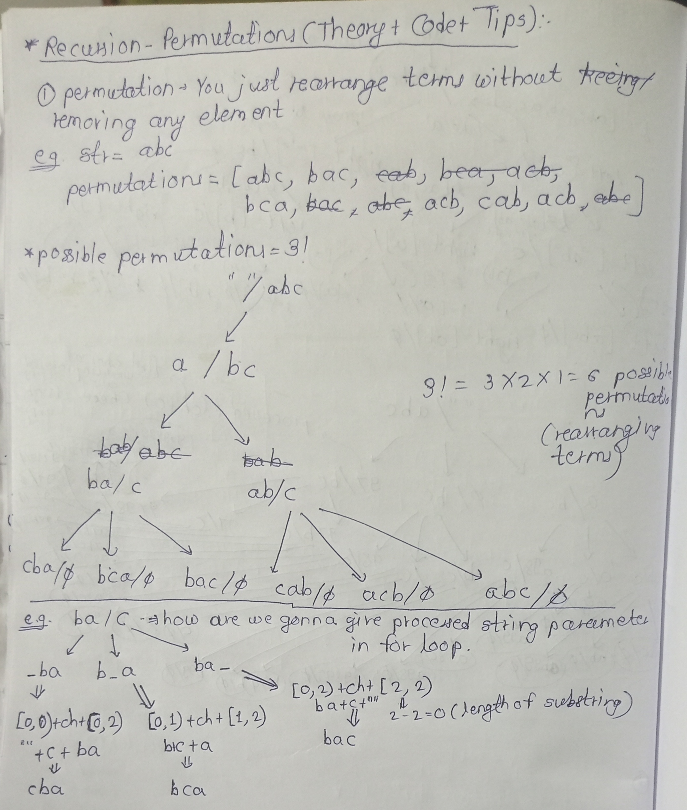
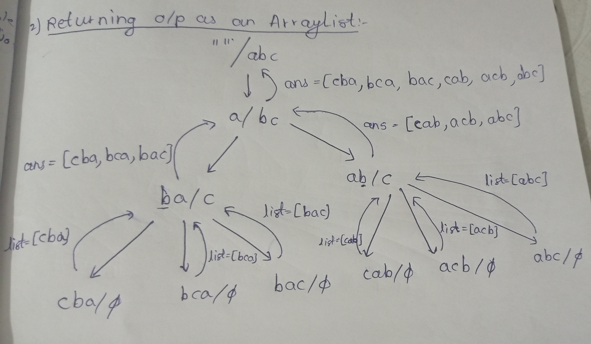
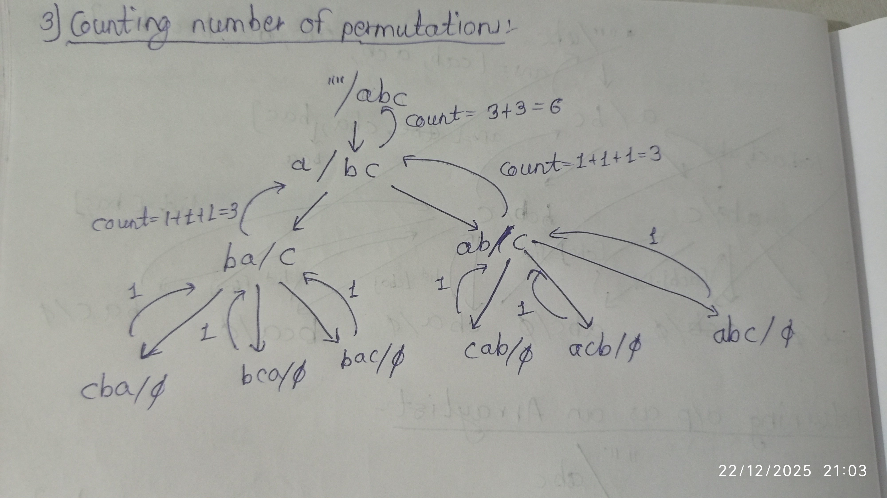

# 1)Find permuations of given string and print those in console.

```java
public class Main {
    public static void main(String[] args) {
       String str = "abc";
       possiblePermutations("", str);
    }

    public static void possiblePermutations(String processed, String unprocessed) {
          if(unprocessed.isEmpty()){
              System.out.println(processed);
              return;
          }
          //for knowing length of substring do => end_index - start_index => [start_index, end_index) => e.g. [0 , 0) => length of substring => 0 - 0 => 0,hence it won't take any substring when length is 0
          char ch = unprocessed.charAt(0);
          //number recursive calls for current processed and unprocessed string are => processed.length() + 1, i.e. 0 till processed.length()
          for(int i = 0; i <= processed.length(); i++){
              String first = processed.substring(0, i);//[0, i)
              String second = processed.substring(i);//or processed.substring(i, processed.length())
              possiblePermutations(first + ch + second, unprocessed.substring(1));
          }
    }
}
o/p:-
cab
bca
bac
cab
acb
abc
```
---
# 2)Returning all permuations in an ArrayList:-

```java
import java.util.ArrayList;
public class Main {
    public static void main(String[] args) {
       String str = "abc";
       System.out.println(possiblePermutations("", str));
    }

    public static ArrayList<String> possiblePermutations(String processed, String unprocessed) {
          if(unprocessed.isEmpty()){
              ArrayList<String> list = new ArrayList<>();
              list.add(processed);
              return list;
          }
          //for knowing length of substring do => end_index - start_index => [start_index, end_index) => e.g. [0 , 0) => length of substring => 0 - 0 => 0,hence it won't take any substring when length is 0
          char ch = unprocessed.charAt(0);
          ArrayList<String> ans = new ArrayList<>();
          for(int i = 0; i <= processed.length(); i++){
              String first = processed.substring(0, i);//[0, i)
              String second = processed.substring(i);//or processed.substring(i, processed.length())
              ans.addAll(possiblePermutations(first + ch + second, unprocessed.substring(1)));
          }
          return ans;
    }
}
o/p:-
[cba, bca, bac, cab, acb, abc]
```
---
# 3)Counting Number of Permutations

```java
public class Main {
    public static void main(String[] args) {
        String str = "abc";
        System.out.println(possiblePermutations("", str));
    }

    public static int possiblePermutations(String processed, String unprocessed) {
        if(unprocessed.isEmpty()){
            return 1;
        }
        //for knowing length of substring do => end_index - start_index => [start_index, end_index) => e.g. [0 , 0) => length of substring => 0 - 0 => 0,hence it won't take any substring when length is 0
        char ch = unprocessed.charAt(0);
        int count = 0;
        for(int i = 0; i <= processed.length(); i++){
            String first = processed.substring(0, i);//[0, i)
            String second = processed.substring(i);//or processed.substring(i, processed.length())
            count += possiblePermutations(first + ch + second, unprocessed.substring(1));
        }
        return count;
    }
}
o/p:-
6
```
---
