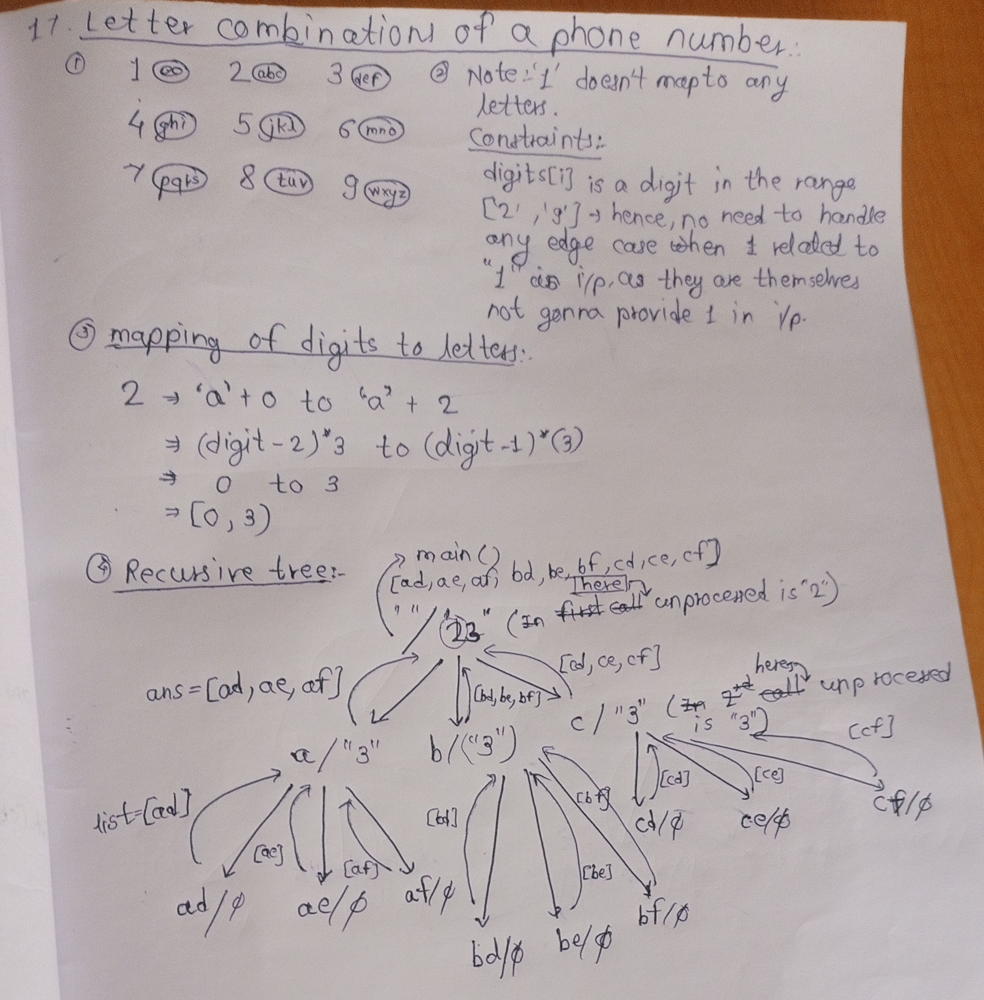

# 1)17. Letter Combinations of a Phone Number
## Given a string containing digits from 2-9 inclusive, return all possible letter combinations that the number could represent. Return the answer in any order. A mapping of digits to letters (just like on the telephone buttons) is given below. Note that 1 does not map to any letters.
## Input: digits = "23" , Output: ["ad","ae","af","bd","be","bf","cd","ce","cf"]

```java
//if you are not understanding code see recursion tree/debug code on IntellijIdea to watch how each function call is getting returned.
import java.util.ArrayList;
public class Main {
    public static void main(String[] args) {
        String str = "23";
        System.out.println(possiblePermutations("", str));
    }

    public static ArrayList<String> possiblePermutations(String processed, String unprocessed){
        if(unprocessed.isEmpty()){
            ArrayList<String> list = new ArrayList<>();
            list.add(processed);
            return list;
        }
        int digit = unprocessed.charAt(0) - '0';/*to extract first character from gien string,e.g.String str = "23", digit = '2' - '0' = 2*/
        ArrayList<String> ans = new ArrayList<>();
        if(digit == 7){
            for(int i = (digit - 2) * 3; i <= (digit - 1) * 3; i++){
                char ch = (char)('a' + i);//to get all possible character from that digit
                ans.addAll(possiblePermutations(processed + ch, unprocessed.substring(1)));
            }
        }
        else if(digit == 8){
            for(int i = 19; i <= 21; i++){
                char ch = (char)('a' + i);//to get all possible character from that digit
                ans.addAll(possiblePermutations(processed + ch, unprocessed.substring(1)));
            }
        }
        else if(digit == 9){
            for(int i = 22; i <= 25; i++){
                char ch = (char)('a' + i);//to get all possible character from that digit
                ans.addAll(possiblePermutations(processed + ch, unprocessed.substring(1)));
            }
        }
        else{
            for(int i = (digit - 2) * 3; i < (digit - 1) * 3; i++){
                char ch = (char)('a' + i);//to get all possible character from that digit
                ans.addAll(possiblePermutations(processed + ch, unprocessed.substring(1)));
            }
        }
        return ans;
    }
}
o/p:-
[ad, ae, af, bd, be, bf, cd, ce, cf]
```
# Returning the count of possible permutations of above problem:-
```java
import java.util.ArrayList;
public class Main {
    public static void main(String[] args) {
        String str = "23";
        System.out.println(possiblePermutations("", str));
    }

    public static int possiblePermutations(String processed, String unprocessed){
        if(unprocessed.isEmpty()){
            System.out.println(processed);
            return 1;
        }
        int count = 0;
        int digit = unprocessed.charAt(0) - '0';/*to extract first character from gien string,e.g.String str = "23", digit = '2' - '0' = 2*/
        ArrayList<String> ans = new ArrayList<>();
        if(digit == 7){
            for(int i = (digit - 2) * 3; i <= (digit - 1) * 3; i++){
                char ch = (char)('a' + i);//to get all possible character from that digit
                count += possiblePermutations(processed + ch, unprocessed.substring(1));

            }
        }
        else if(digit == 8){
            for(int i = 19; i <= 21; i++){
                char ch = (char)('a' + i);//to get all possible character from that digit
                count += possiblePermutations(processed + ch, unprocessed.substring(1));
            }
        }
        else if(digit == 9){
            for(int i = 22; i <= 25; i++){
                char ch = (char)('a' + i);//to get all possible character from that digit
                count += possiblePermutations(processed + ch, unprocessed.substring(1));
            }
        }
        else{
            for(int i = (digit - 2) * 3; i < (digit - 1) * 3; i++){
                char ch = (char)('a' + i);//to get all possible character from that digit
                count += possiblePermutations(processed + ch, unprocessed.substring(1));
            }
        }
        return count;

    }
}
op:-
ad
ae
af
bd
be
bf
cd
ce
cf
9
```
---
# Dice Throw1:-
## You have given a dice and you have to return ArrayList containing all possible combinations of rolling of a dice to get targetSum 

```java
import java.util.ArrayList;
public class Main {
    public static void main(String[] args) {
        int faces = 6;
        System.out.println(possibleCombinations("", 5, faces));
    }

    public static ArrayList<String> possibleCombinations(String combination, int targetSum, int faces){
            if(targetSum == 0){
                ArrayList<String> list = new ArrayList<>();
                list.add(combination);
                return list;
            }
            ArrayList<String> ans = new ArrayList<>();
            for(int i = 1; i <= 6 && i <= targetSum; i++){
                ans.addAll(possibleCombinations(combination + i, targetSum - i, faces));
            }
            return ans;

    }
}
o/p:-
[11111, 1112, 1121, 113, 1211, 122, 131, 14, 2111, 212, 221, 23, 311, 32, 41, 5]
```
---
# Dice Throw
## Given n dices each with m faces, numbered from 1 to m, the task is to find the number of ways to get sum x. x is the summation of values on each face when all the dice are thrown.
## Examples: Input: m = 6, n = 3, x = 12 , Output: 25
## Explanation: There are 25 total ways to get the Sum 12 using 3 dices with faces from 1 to 6.
```java
class GfG {

    static int noOfWays(int m, int n, int x) {
        
        // Base case: Valid combination
        if (n == 0 && x == 0) return 1;
        
        // Base case: Invalid combination
        if (n == 0 || x <= 0) return 0;
        
        int ans = 0;
        
        // Check for all values of m.
        for (int i = 1; i <= m; i++) {
            ans += noOfWays(m, n - 1, x - i);
        }
        
        return ans;
    }

    public static void main(String[] args) {
        int m = 6, n = 3, x = 8;
        System.out.println(noOfWays(m, n, x));
    }
}
o/p:-21
```
