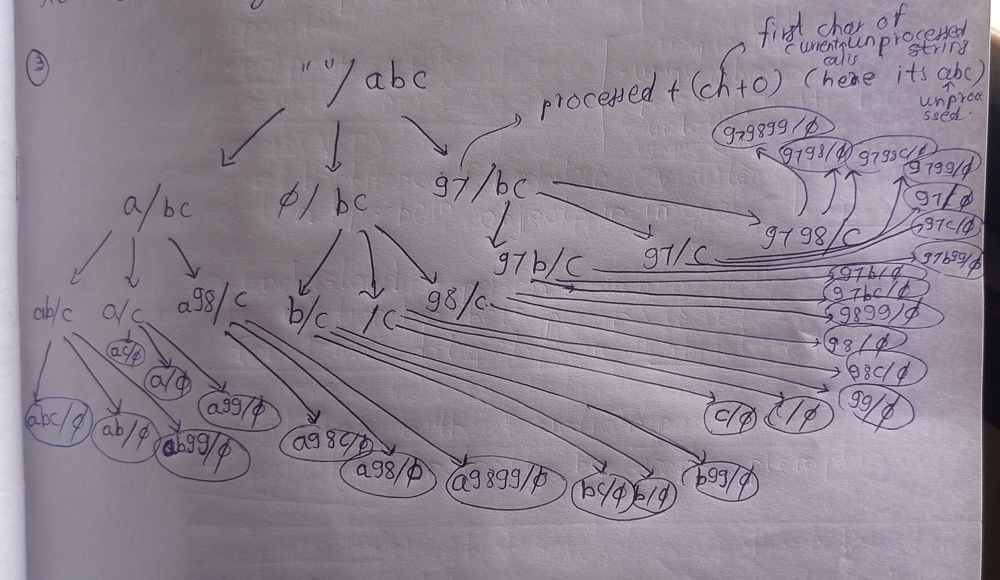
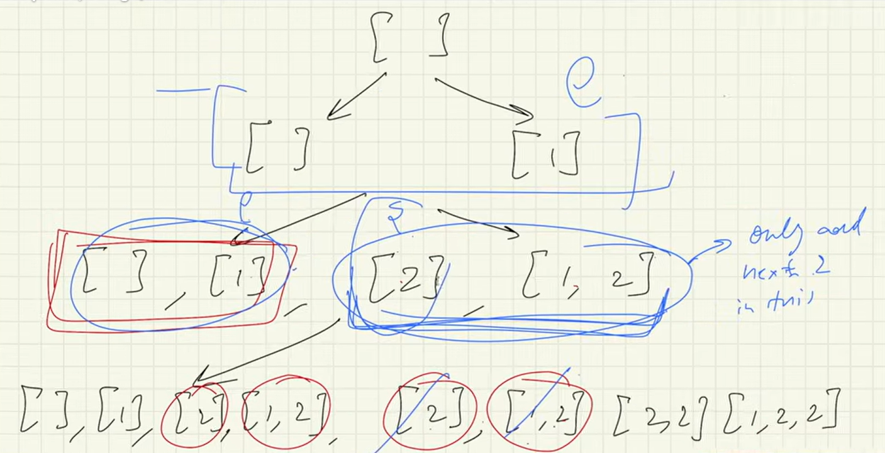
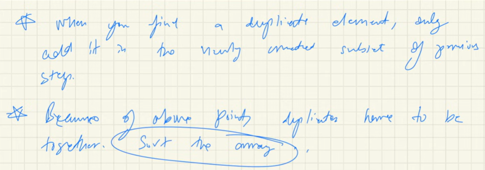

# 1) Return a String with all 'a's removed
---
## Approach 1: Modify `ans` string in arguments (No return)
- Pass an extra `ans` string
- Do not return anything
- Print result at base case

```java
public class Main {
    public static void main(String[] args) {
        String str = "bccedafg";
        removea(str,""); // removea(mainString, answerString)
    }

    // Recursive function to remove 'a'
    public static void removea(String str, String ans){
        if(str.isEmpty()){
            System.out.println(ans);
            return;
        }
        char ch = str.charAt(0);
        if(ch == 'a'){
            removea(str.substring(1), ans); // skip 'a'
        } else {
            removea(str.substring(1), ans + ch); // add non-'a'
        }
    }
}
---
## Approach 2: Return answer string to main
- No extra argument needed
- Build answer while returning

```java
public class Main {
    public static void main(String[] args) {
        String str = "bccedafg";
        System.out.println(removea(str)); // call recursive function
    }

    // Recursive function to remove 'a'
    public static String removea(String str){
        if(str.isEmpty()){
            return ""; // base case
        }
        char ch = str.charAt(0);
        if(ch == 'a'){
            return removea(str.substring(1)); // skip 'a'
        } else {
            return ch + removea(str.substring(1)); // add non-'a'
        }
    }
}
```
# Subsets:-
- Whenever you are dealing with permutation or combinations like creating all possible subsets( [a, b]=[b, a] = same subset but return subset in a given order of elements.as order may matter in subsets,e.g.[a, b, c] = [], [a], [b], [c], [a, b], [b, c], [a, c], [a, b, c] = 8 possible subsets)
- Subsets - Non - Adjacent Collection
# 2)Return all possible subsequences of given String:-
---
## Approach 1:- Print all possible subsequences in a String.


```java
public class Main {
    public static void main(String[] args) {
        String str = "abc";
        possibleSubsets("", str);

    }
    public static void possibleSubsets(String processed, String unprocessed){
          if(unprocessed.isEmpty() == true){
            System.out.println(processed);
            return;
          }
          char ch = unprocessed.charAt(0);
          possibleSubsets(processed + ch, unprocessed.substring(1));
          possibleSubsets(processed, unprocessed.substring(1));
    }
}
o/p:-
abc
ab
ac
a
bc
b
c

```

## Approach 2:-return all possible subsequences in an ArrayList:-
---


```java
import java.util.ArrayList;
public class Main {
    public static void main(String[] args) {
        String str = "abc";
        System.out.println(possibleSubsets("", str));

    }
    public static ArrayList<String> possibleSubsets(String processed, String unprocessed){
        if(unprocessed.isEmpty() == true){
            ArrayList<String> ans = new ArrayList<>();
            ans.add(processed);//add subsequences we were getting at the end of recursive tree
            return ans;
        }
        char ch = unprocessed.charAt(0);
        //take first char
        ArrayList<String> left = possibleSubsets(processed + ch, unprocessed.substring(1));
        //skip first char and take processed string as it is
        ArrayList<String> right = possibleSubsets(processed, unprocessed.substring(1));
        left.addAll(right);//add answers from both sides,left and right
        return left;

    }
}
o/p:-[abc, ab, ac, a, bc, b, c, ]
```
# 3)Return all possible subsequences along with ascii value of character which you are keeping.
---


```java
import java.util.ArrayList;
public class Main {
    public static void main(String[] args) {
        String str = "abc";
        System.out.println(possibleSubsets("", str));

    }
    public static ArrayList<String> possibleSubsets(String processed, String unprocessed){
        if(unprocessed.isEmpty() == true){
            ArrayList<String> ans = new ArrayList<>();
            ans.add(processed);//add subsequences we were getting at the end of recursive tree
            return ans;
        }
        char ch = unprocessed.charAt(0);
        //take first char of unprocessed string
        ArrayList<String> left = possibleSubsets(processed + ch, unprocessed.substring(1));
        //skip first char and take processed string as it is
        ArrayList<String> right = possibleSubsets(processed, unprocessed.substring(1));
        //take ascii value of first character of unprocessed string,when you want ascii value of character just add 0 in it
        ArrayList<String> first = possibleSubsets(processed + (ch + 0), unprocessed.substring(1));
        left.addAll(right);//add answers from both sides,left and right
        left.addAll(first);
        return left;

    }
}
o/p:-[abc, ab, ab99, ac, a, a99, a98c, a98, a9899, bc, b, b99, c, , 99, 98c, 98, 9899, 97bc, 97b, 97b99, 97c, 97, 9799, 9798c, 9798, 979899]
```
# 4)Return all posssible subsets from given array of elements:- N = number of elements in an array
---


- T.C:-number of levels in a recursive tree * total number of subsets at each level = O(N * 2^N)
- S.C:-number of levels(space taken by each subset in an overall recursive tree obviously one space at each level) * 2^N(total number of subsets) = O(N * 2^N)
```java
import java.util.ArrayList;
public class Main {
    public static void main(String[] args) {
        int[] arr = {1, 2, 3};
        System.out.println(possibleSubsets(arr));
        }

    public static ArrayList<ArrayList<Integer>> possibleSubsets(int[] arr) {
        ArrayList<ArrayList<Integer>> outer = new ArrayList<>();
        //outer list is whole list including all subsets lists at particular level
        //initially add empty list to it as per recursion tree
        outer.add(new ArrayList<>());

        //for every number in an array ,I need to take an size of this outer list(initially its 1 as there is only one empty list in an ArrayList) and create a copy of list's one by one present inside an outer array and create new list(containing element from an Array which we have to keep and elements from old ith list which we have copied using outer.get(i)) and add it in my original list
        //original list = current outer list
        //take size of outer list to create number of ArrayLists = current size of outer ArrayList, to add those in an outer ArrayList.
        for (int num : arr) {
            int size = outer.size();
            for (int i = 0; i < size; i++) {
                //Create a new list to add arr elements in it to create subset
                ArrayList<Integer> inner = new ArrayList<>(outer.get(i));//to create copy of outer list's ith list and then add arr elements each of ith list with one iteration.
                inner.add(num);
                outer.add(inner);
            }
        }
        return outer;
    }
}
o/p:-
[[], [1], [2], [1, 2], [3], [1, 3], [2, 3], [1, 2, 3]]
```
# 5)Create all possible subsets Array(having duplicates in it):-
---


```java
import java.util.ArrayList;
import java.util.Arrays;

public class Main {
    public static void main(String[] args) {
        int[] arr = {1, 2, 2};
        System.out.println(possibleSubsets(arr));
    }

    public static ArrayList<ArrayList<Integer>> possibleSubsets(int[] arr) {
        Arrays.sort(arr);//MUST for duplicates.

        ArrayList<ArrayList<Integer>> outer = new ArrayList<>();
        outer.add(new ArrayList<>());

        int start = 0;
        int end = 0;

        for (int j = 0; j < arr.length; j++) {
            start = 0;

            // if current element is duplicate, only add to subsets created in previous step/newly created previous subsets
            if (j > 0 && arr[j] == arr[j - 1]) {
                start = end + 1;
            }

            end = outer.size() - 1;/*to get the size of next start index if next element is duplicate element as (start = end + 1) if element is duplicate as given in recursion tree.*/
            int size = outer.size();

            for (int i = start; i < size; i++) {
                ArrayList<Integer> inner = new ArrayList<>(outer.get(i));
                inner.add(arr[j]);//
                outer.add(inner);
            }
        }
        return outer;
    }
}
o/p:-
[[], [1], [2], [1, 2], [2, 2], [1, 2, 2]]
```

