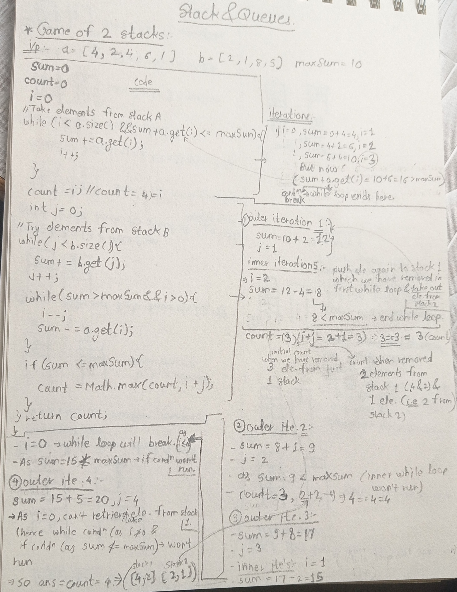
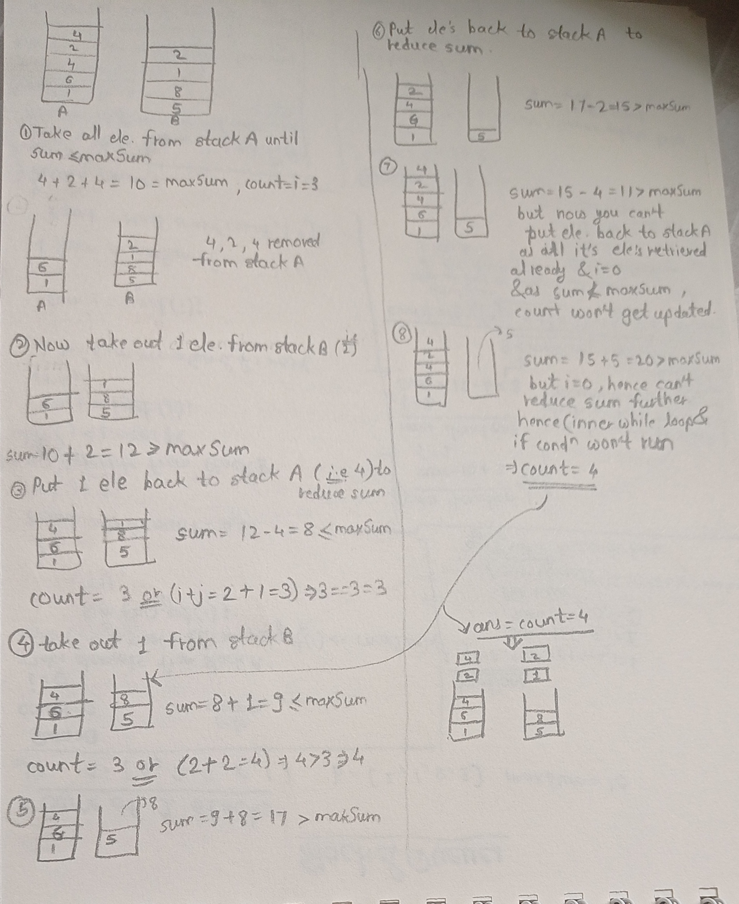
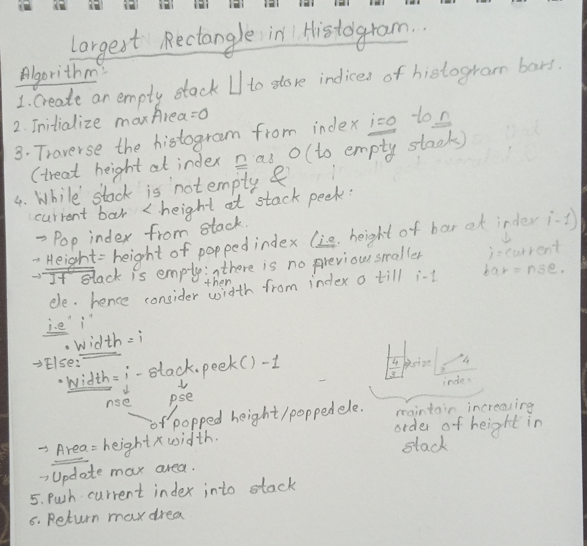

#### 1)Implement Queue using stacks:-
- Insert efficient i.e. .insert() :- T.C:-O(1)
```java
/**
 * Problem Link:
 * https://leetcode.com/problems/implement-queue-using-stacks/
 *
 * Approach:
 * Queue is implemented using two stacks.
 * - first stack is treated as the main stack (represents the queue)
 * - second stack is used as a helper stack during pop and peek operations
 *
 * For pop/peek:
 * - Move all elements from first stack to second stack
 * - Perform pop/peek on second stack
 * - Move elements back to first stack
 *
 * Time Complexity:
 * push()  -> O(1)
 * pop()   -> O(n)
 * peek()  -> O(n)
 * empty() -> O(1)
 *
 * Space Complexity:
 * O(n) where n is the number of elements in the queue
 */

class MyQueue {
    Stack<Integer> first;
    Stack<Integer> second;

    public MyQueue() {
        first = new Stack<>();
        second = new Stack<>();
    }
    
    // Insert element into queue
    public void push(int x) {
        first.push(x);
    }

    // Removal:- O(n)
    public int pop() {
        // Move all elements to second stack
        while(!first.empty()){
            second.push(first.pop());
        }

        // Remove front element
        int removed = second.pop();

        // Move elements back to first stack
        while(!second.empty()){
            first.push(second.pop());
        }

        return removed;
    }
    
    // Returns front element without removing it
    public int peek() {
        // Move all elements to second stack
        while(!first.isEmpty()){
            second.push(first.pop());
        }

        int removed = second.peek();

        // Move elements back to first stack
        while(!second.isEmpty()){
            first.push(second.pop());
        }

        return removed;
    }
    
    public boolean empty() {
        // first stack represents the queue
        // if first stack is empty, queue is empty
        return first.isEmpty(); // this is the method which we will be using on Queue data structure in main method
    }
}

/**
 * Your MyQueue object will be instantiated and called as such:
 * MyQueue obj = new MyQueue();
 * obj.push(x);
 * int param_2 = obj.pop();
 * int param_3 = obj.peek();
 * boolean param_4 = obj.empty();
 */
```
- Remove efficient:-
```java
class MyQueue {
    Stack<Integer> first;
    Stack<Integer> second;

    public MyQueue() {
        first = new Stack<>();
        second = new Stack<>();
    }
    //Insert :- O(n)
    public void push(int x) {
        while(!first.isEmpty()){
             second.push(first.pop());
        }

        first.push(x);

        while(!second.isEmpty()){
            first.push(second.pop());
        }

    }

    public int pop() {
        return first.pop();
    }
    
    public int peek() {
        return first.peek();
    }
    
    public boolean empty() {
        return first.isEmpty();//this is the method which we will be using on Queue datastructure in main method but we can use the functionality of stack i.e. .isEmpty() and as first stack is our main stack(or implemeted Queue), if that is empty then our Queue will be empty 
    }
}

/**
 * Your MyQueue object will be instantiated and called as such:
 * MyQueue obj = new MyQueue();
 * obj.push(x);
 * int param_2 = obj.pop();
 * int param_3 = obj.peek();
 * boolean param_4 = obj.empty();
 */
```

####  Game of two stacks:-
Brute-force approach:-Recursive approach
```java
/**
*Problem link:-https://www.hackerrank.com/challenges/game-of-two-stacks/problem
*
*T.C-O(2^(n +m))
 Recursion depth ≤ m + n
 Branching factor = 2
 Hence exponential time
*S.C:-O(m + n)->total space complexity including inputs but ignoring sublist views/Stack space view
*/


/**
 * Time Complexity:
 * Exponential time -> O(2^(n + m))
 * At each step, we have two choices:
 * - take element from stack A
 * - take element from stack B
 * This leads to exploring all possible combinations.
 *
 * Space Complexity:
 * O(n + m)
 * Due to recursive call stack depth in the worst case.
 * (Ignoring extra memory used by subList views)
 *
 * Note:
 * This is a brute-force recursive solution.
 * Works for small inputs but fails for large inputs due to TLE.
 */


public class Result{
    public static int twoStacks(int maxSum, List<Integer> a, List<Integer> b) {
    // Write your code here
    return maxCount(a, b, maxSum, 0, 0) - 1;//return maxCount(a, b, maxSum, currentSum, count) - 1;

    }
    
    public static int maxCount(List<Integer> a, List<Integer> b, int maxSum, int currentSum, int count){
        //base case if currentSum exceeds maxSum return the count and as count we are returning is the one which we have got after breaking the condition i.e. last number which we have added which leads currentSum to exceed maxSum must be extra in the count if we decrease it we will get currentSum <= maxSum which we want at the end by adding numbers hence we decrease that extra number(in twoStacks()) from count to get correct count of numbers such that when we add those numbers we get currentSum <= maxSum given in problem stmt
        if(currentSum > maxSum){
            return count;
        }
        
        //even if one of the array gets empty return the count as if one of the array gets empty we won't be able to call below to functions and will never be able to return current count
        if(a.size() == 0 || b.size() == 0){
            return count;
        }
        
        //otherwise take 1 element from 1 list keep the other list same and add that in currentSum sum and increase the count by one and do the same gor other list in other function call and return the max count which we will get out of both function calls
        int ans1 = maxCount(a.subList(1, a.size()), b, maxSum, currentSum + a.get(0), count + 1);
        int ans2 = maxCount(a, b.subList(1, b.size()), maxSum, currentSum + b.get(0), count + 1);
        
        return Math.max(ans1, ans2);
    }  

}
```
Optimized solution:- Greedy approach


```java
/**
*Note on Time Complexity:
 Even though this while loop is inside another loop, it does NOT make the solution O(n^2).
 The pointer 'i' only moves backward and each element of stack A is removed at most once.
 Across the entire algorithm, total increments and decrements of 'i' are bounded by a.size().
 Hence, the overall time complexity remains O(n + m).
*S.C:-O(1)
*/
class Result {
    /*
     * Complete the 'twoStacks' function below.
     *
     * The function is expected to return an INTEGER.
     * The function accepts following parameters:
     *  1. INTEGER maxSum
     *  2. INTEGER_ARRAY a
     *  3. INTEGER_ARRAY b
     */

    public static int twoStacks(int maxSum, List<Integer> a, List<Integer> b) {
    int sum = 0;
    int count = 0;
    int i = 0;
    //Take elements from a until sum <= maxSum, (a.get(i) + sum) is next sum and not the previous one 
    while(i < a.size() && (a.get(i) + sum) <= maxSum){
        sum += a.get(i);
        i++;
    }  
    
    count = i;
    int j = 0;
    
    //Now take elements from B and -> put retrieved elements back to A if sum exceeds maxSum
    while(j < b.size()){
        sum += b.get(j);
        j++;
        
        //i < 0 because we are first doing i-- and then retrieving element, hence when we retrive element when i = 0; and then checked in while condition whether i < 0 -> condition will break and while loop will end as i = 0 which is correct as we can't retieve elements as 0th element retrieved already in previous iteration.
        while(i > 0 && sum > maxSum){
            i--;
            sum -= a.get(i);
        }
        
        if(sum <= maxSum){
            count = Math.max(count, i + j);
        }
    }
    return count; 
    

    }  
}
->Input (stdin)
1
5 4 10
4 2 4 6 1
2 1 8 5
->Expected Output
4
```
#### Next Greater element:-
- Brute-force approach:-
```java
//Problem link:-https://leetcode.com/problems/next-greater-element-i/
// Time Complexity:
// Stack processing for nums2: O(m)
// Mapping nums1 elements: O(n * m)
// Overall: O(n * m)

// Space Complexity:
// Stack + NGE array: O(m)
// Result array: O(n)
// Overall: O(n + m)

class Solution {
    public int[] nextGreaterElement(int[] nums1, int[] nums2) {
        //nums1 = query array(contains elements of which we have to find next greater element)
        //nums2 = main array

        int[] nge = new int[nums2.length];
        Stack<Integer> stack = new Stack<Integer>();

        int i = nums2.length - 1;
        //find next gretaer for all elements in nums2 array
        while(i >= 0){
             //remove lements until we get peek element in an stack greater than current element of an array 2 
             while(!stack.isEmpty() && nums2[i] <= stack.peek()){
                stack.pop();
             }
            //if we don't find any greater element for current element even after stack becomes empty return -1
             if(stack.isEmpty()){
                nge[i] = -1;
             }
             else{//if fount then store it in nge[]
                nge[i] = stack.peek();
             }

             //and then push it in a stack
             stack.push(nums2[i]);
             i--;

        }

        //make array to store only queried elements
        int[] ans = new int[nums1.length];
        for(int j = 0; j < nums1.length; j++){
            for(int k = 0; k < nums2.length; k++){
                 if(nums1[j] == nums2[k]){
                    ans[j] = nge[k];
                 }
            }

        }

        return ans;

    }
}
Input: nums1 = [4,1,2], nums2 = [1,3,4,2]
Output: [-1,3,-1]
Explanation: The next greater element for each value of nums1 is as follows:
- 4 is underlined in nums2 = [1,3,4,2]. There is no next greater element, so the answer is -1.
- 1 is underlined in nums2 = [1,3,4,2]. The next greater element is 3.
- 2 is underlined in nums2 = [1,3,4,2]. There is no next greater element, so the answer is -1.
```
#### Previous smaller element:-
- for visualization see striver sheet blog for this question.
```java
/**
 * Time Complexity:
 * Push operations  -> O(n) (each element is pushed once)
 * Pop operations   -> O(n) (each element is popped at most once)
 * Total T.C.       -> O(n)
 *
 * Space Complexity:
 * Stack usage      -> O(n)
 * Result array     -> O(n)
 * Total S.C.       -> O(n)
 */

class Solution {
    public static ArrayList<Integer> prevSmaller(int[] arr) {

        ArrayList<Integer> ans = new ArrayList<>();
        Stack<Integer> stack = new Stack<>();
        int n = arr.length;

        for (int i = 0; i < n; i++) {

            // Pop elements until we find a smaller element
            while (!stack.isEmpty() && stack.peek() >= arr[i]) {
                stack.pop();
            }

            // If stack is empty, no previous smaller element
            if (stack.isEmpty()) {
                ans.add(-1);
            } else {
                ans.add(stack.peek());
            }

            // Push current element into stack
            stack.push(arr[i]);
        }

        return ans;
    }
}
Input: arr[] = [1, 6, 2]
Output: [-1, 1, 1]
Explanation:
For 1, there is no element on the left, so answer is -1.
For 6, previous smaller element is 1.
For 2, previous smaller element is 1.
```
#### Largest Rectangle in Histogram:-
-to understand logic , you can watch strivers nge, pse and Largest area in histogram video/you can read his blogs.
- Brute-force approach:- Algorithm
- 1)find indices ofnse and pse for all bars/heights at every indices and store them in nse[] and pse[] 
- 2)then calculate width for each bar by traversing throught each height and calculating area for that height using formula :- nse - pse - 1(remember nse and pse are indices)
- 3)and return maxArea from them.
```java
/*
Brute Force Approach:

Time Complexity:
- Finding NSE for all bars: O(n²)
- Finding PSE for all bars: O(n²)
- Area calculation: O(n)
- Total T.C.: O(n²)

Space Complexity:
- NSE array: O(n)
- PSE array: O(n)
- Total S.C.: O(n)
*/
```
---
- Optimized approach:-
- 
```java
//Problem Link:- https://leetcode.com/problems/largest-rectangle-in-histogram/
// Time Complexity:
// Push operations -> O(n)
// Pop operations  -> O(n)
// Total T.C.      -> O(n)

// Space Complexity:
// Stack usage     -> O(n)
// Total S.C.      -> O(n)

class Solution {
    public int largestRectangleArea(int[] heights) {
        //to store increasing order of heights in stack and get those heights back in order
        Stack<Integer> stack = new Stack<>();
        int maxArea = 0;
        int n = heights.length;
        
        //to traverse heights[]
        for(int i = 0; i <= n; i++){

            //if we have got the nse i.e heights[i] <= heights[stack.peek()]
            //then calculate area of rectangle for popped bar
            while(!stack.isEmpty() && (i == n || heights[stack.peek()] >= heights[i])){
                 
                 //height of rectangle is the height of popped bar
                 int height = heights[stack.pop()];
                 
                 int width;
                 if(stack.isEmpty()){
                    //no previous smaller element exists
                    //rectangle spans from index 0 to i-1
                    width = i;
                 } 
                 else{
                    //i = nse, stack.peek() = pse
                    //rectangle spans from stack.peek()+1 to i-1
                    width = i - stack.peek() - 1;
                 }

                 int area = height * width;
                 maxArea = Math.max(maxArea, area);
            }

            //push index of current bar into stack
            stack.push(i);
        }

        return maxArea;
    }
}
Input: heights = [2,1,5,6,2,3]
Output: 10
Explanation: The above is a histogram where width of each bar is 1.
The largest rectangle is shown in the red area, which has an area = 10 units.
```

####  Valid parentheses:-
```java
//Problem link :- https://leetcode.com/problems/valid-parentheses/
//T.C:- O(n)
//S.C:-O(n)->to store one stack whiich can have at max s.length() size

class Solution {
    public boolean isValid(String s) {
        Stack<Character> stack = new Stack<>();
        
        int i = 0;
        while (i < s.length()) {
            char ch = s.charAt(i);

            // if opening bracket, push into stack
            if (ch == '(' || ch == '{' || ch == '[') {
                stack.push(ch);
            }
            // if closing bracket
            else {
                // stack must not be empty
                if (stack.isEmpty()) return false;

                // check matching pair
                if (ch == '}' && stack.peek() == '{') stack.pop();
                else if (ch == ')' && stack.peek() == '(') stack.pop();
                else if (ch == ']' && stack.peek() == '[') stack.pop();
                else return false; // mismatch
            }

            i++;
        }

        // if stack is empty, all brackets are matched
        return stack.isEmpty();
    }
}

Example 4:
Input: s = "([])"
Output: true
```

#### Minimum add to make parentheses valid:-
```java
//Problem link :- https://leetcode.com/problems/minimum-add-to-make-parentheses-valid/description/
//T.C:- O(n)
//S.C:-O(n)
class Solution {
    public int minAddToMakeValid(String s) {
        Stack<Character> stack = new Stack<>();

        for (char ch : s.toCharArray()) {
            // if opening bracket, push
            if (ch == '(') {
                stack.push(ch);
            }
            // if closing bracket and matching opening exists, pop
            else if (ch == ')' && !stack.isEmpty() && stack.peek() == '(') {
                stack.pop();
            }
            // otherwise, push unmatched closing bracket
            else {
                stack.push(ch);
            }
        }

        // remaining stack size = minimum brackets needed
        return stack.size();
    }
}
Example 2:

Input: s = "((("
Output: 3
```
#### Minimum insertions to balance a parentheses string:-
- Valid parenthesis if opening bracket '(' has two corresponding closng brackets '))'
```java
//Problem link :- https://leetcode.com/problems/minimum-insertions-to-balance-a-parentheses-string/description/
//T.C:-O(n)
//S.C:-O(n)
